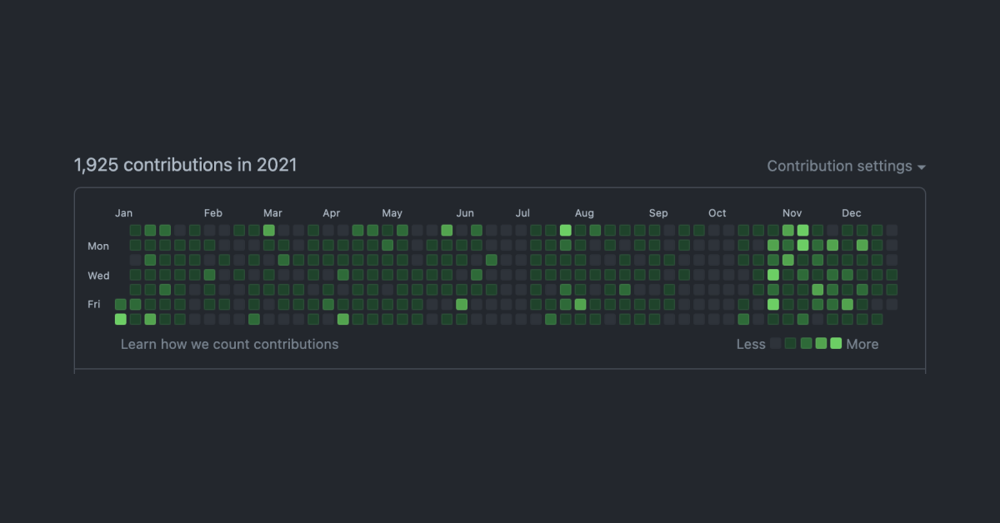
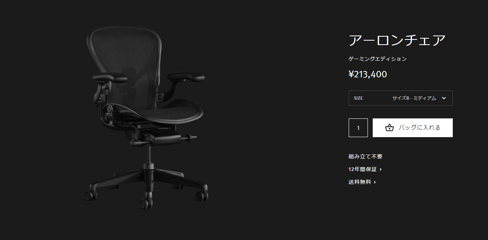
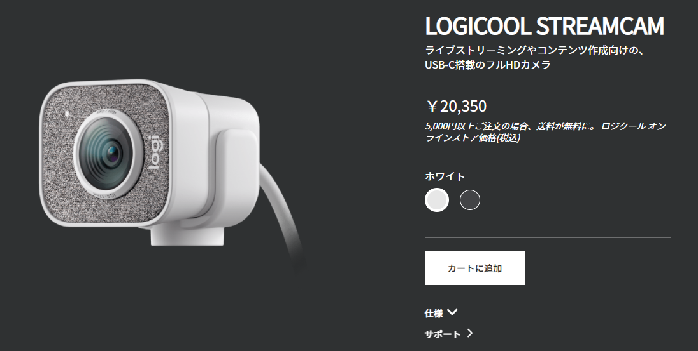

2021年が残り数日で終わるので反省も兼ねて振り返ります。

## Overview 👀
就活が2月までに終わったので、研究や開発、趣味に多くの時間を割くことができました。ただ、研究の開発に "逃げていた" 一年間だったなと思う瞬間もあります。

### 1~3月
1月末に内定承諾をして就活が終わりました。２月は就活疲れの休養とSwiftの勉強をしつつ、ブログ等のインフラ環境をAWSに移行したりしてました。

3月からは内定者インターンをリモートで行っていました。エンジニアバイトはしたことがありましが、ベンチャー企業での長期インターンは初めてだったこともあり、スピード感や初めて触る技術を**リモートで**キャッチアップするのは（私は）向いてないことに気がついた１ヶ月でした。

３月は研究の引き継ぎと急を要する開発のタスクが舞い込んできた１ヶ月だったこともあり、かなり~~疲弊~~成長した気がします。

### 4~6月
4月も引き続き内定者インターンを行っていました。ワクチンが存在しない世界でコロナが猛威を奮っていた時期ですが、緊急事態の合間を突いて東京でオフラインのインターンも行いました。３月時点ではキャッチできなかった空気感やスピード感を肌で感じることができ、非常に充実していました。

5-6月は研究で引き継いだシステムに重大な欠陥が発覚し、大炎上してました。

### 7~9月
引き続き研究で利用するシステムの開発をしていました。

7月より、システムのフルリプレイスを開始し、DBの設計やアーキテクチャ選定などを通して普段考えない粒度の技術について学ぶことができました。

### 10~12月
後輩の技術に対する理解がかなり低いことが判明し、研究のモチベが低下したので、ブログを作り変えることにしました。Gatsbyを利用したブログを作り直し、Gatsby v5に対応したり、AWSのCloudFront+Labda@edgeを利用してS3に保存してあるサイトデータに対してDefaultObject（`hogehoge.com/fugafuga/`）にアクセスが来た場合は、`hogehoge.com/fugafuga/index.html`を返すようにしたりしました。StackOverflowでもあまり確認できない問題だったので4日ほど掛かりましたが、AWSについてより深く学習することができました。

11月末に研究で利用するシステムのAPIサーバーが完成したので、フロントの開発をはじめました。年末にはほぼ完成したので、1月からは自由になれそうです。

## Goal 🏁
2020年1月に[今年の目標](/goal2021/)を決めました。

途中から盛大にズレていった気がしますが、一応振り返ります。

### インフラ環境をAWSに全移行
結果：⭕️

高校時代に作ったメディアサイトや、このブログを以前利用していたホスティングサービスからAWSに完全移行しました。

パフォーマンスはほぼ同等で、月額の利用金額を40%ほど安くすることに成功しました。ただ、ホスティングサービスだと簡単に設定できた独自ドメインのメールリレーが、AWSの場合は従量課金制なのでお金がかかるのが痛いところです。

[さくらのメールボックス](https://rs.sakura.ad.jp/mail/)というサービスを利用して月額100円以下でメールのリレーを行っていましたが、メールボックスの機能（or 設定）が悪かったらしく、思ったように利用ができなかったので、独自ドメインのメール利用を取りやめました。

AWSの機能的な部分だけでなく、インターネットの低レイヤーの動作について学習することができました。

### 毎月サービスリリース
結果：❌

全くできませんでした。すみません。アイデアもそんなに思いついてません。

### 就活を終える
結果：⭕️

1月に終わりました。選択が間違っていたのか、正しかったのかは全く分からないですが、とにかく終わりました。自分の決断に後悔はしてません。

### 減量と筋トレ
結果：❌

4月までは順調に減量と筋肉量の増加ができていましたが、5月ごろから急増してしまい、今や体が丸いです。朝起きたら何かしら食べ物がある実家は最高です👍。

2022年も継続してやっていきます。

## Good or Bad Products
今年買って良かった物、悪かった物

### Good Product

Herman Miller - Aeron Remasterd Gaming edition.

アーロンチェアでお馴染みのHerman Millerから発売されている「アーロンチェア ゲーミングエディション」が最高に良かったです。値段が20万を超えるめちゃくちゃ良い椅子ですが、開発等で長時間座っていても全く腰が痛くならないです。12年保証がついているので、月額1,500円で利用できると思えばかなり安い？かと。

ただ、本体の重さが23kgもあり、箱も超大型なので引越し前に購入したのは、、、（一般的な引越し時のダンボール12箱相当）。

### Bad Product

Logicool - StreamCam C980OW

オンライン就活やリモートワークを見越して購入した同製品ですが、カメラの画質は申し分ないほど良いのですが、マイク性能が微妙です。音を**拾いすぎてしまう**んですよね。キーボードの音はもちろん、指をポキっと鳴らした音や、マイクのクリック音など30cm以上離れていてもかなり大きい音で拾ってしまいます。
マイクは別で購入するして利用するほうがストレス無く通話ができると思います。

## SNS Commitment
- Twitter
    - Tweet：763（👇289）
    - Impression：243,326（👇216,497）
- Github
    - Contributions：1925（👆148）

昨年度に比べて開発する時間・量が増加しました。
Twitterは前と同じような時間を費やしていますが、アウトプットよりインプットのほうが多くなりつつあるみたいです。

## 2022年はこんな一年にしたい 🏁
研究に逃げていた一年でしたが、「モノ・コトに集中して周辺の設計・戦略を考えることは得意」であることに気がついた一年でした。逆に、お金が関わる複数の選択肢を比較検討することは苦手だと気づくこともできました（ホテル・アパート探しなど）。

22年間、親のすねをかじって生きてきたわけですが、ついに出社する時間になったらしいです。
正直、結構ビビってますが、自分が選んだ場所を目指して前向きに頑張っていきます。

2021年、たくさんの人にお世話になりました。来年もよろしくお願いします！！

ではでは 🤟
