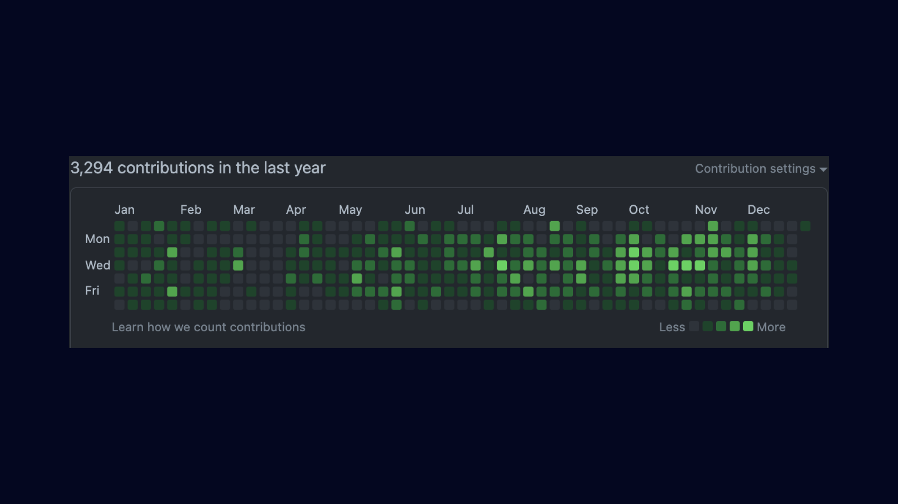
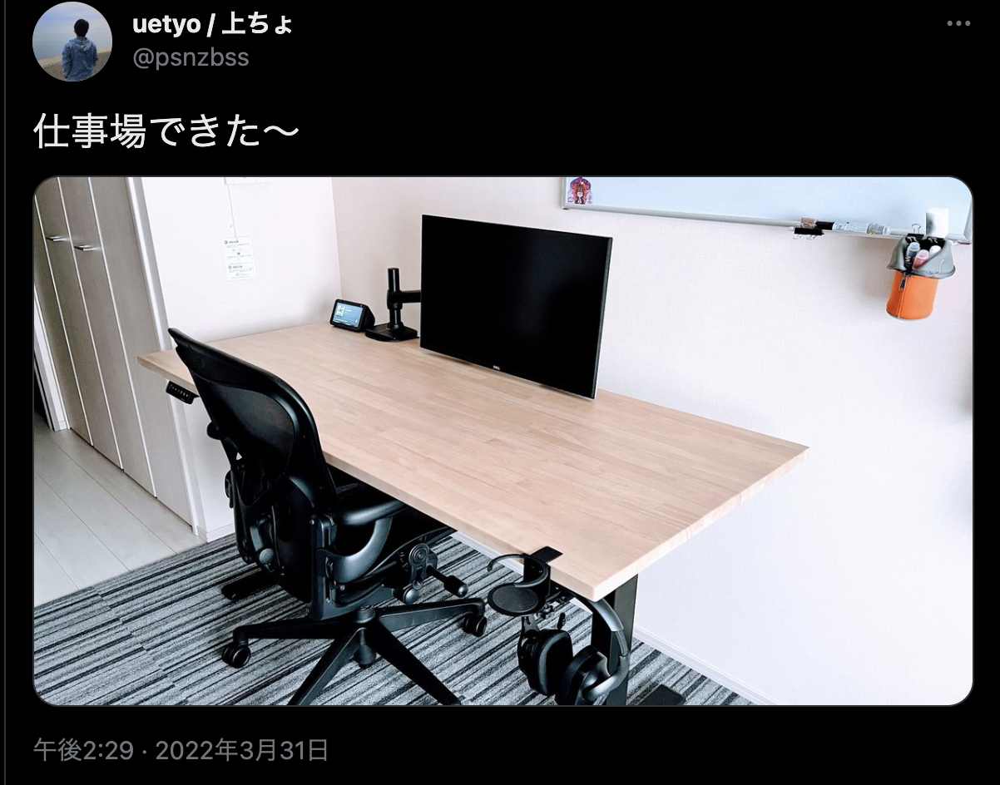

2022年が残り数日で終わるので反省も兼ねて振り返ります

## Overview 👀
無事大学を卒業して新卒エンジニアとして働き始めました

まだまだできることが少ないですが来年も気合入れていきます🔥

## Good or Bad Products
今年購入・契約して良かった物、悪かった物

### Good Product
今年購入して一番良かったもの

https://twitter.com/psnzbss/status/1509402528076558339

新居用に新しく作った机が一番のお買い物でした〜！

フレームはFlexiSpot、天板はかなでもので購入して組み立てた電動昇降式テーブルで、木の肌触りが最高です！

### Bad Product
9月以降よく炎上しているNURO光が今年購入して一番良くなかったものです。20時以降はYouTubeのFHD再生も怪しい状況が未だに続いています、日中は調子が良いんですけどねぇ、、、

## SNS Commitment
- Twitter
    - Tweet：550（👇213）
    - Impression：127,386（👇115,940）
- Github
    - Contributions：3,269（👆1,344）

ツイート数はかなり減りましたが、GitHubのコミット数が激増しました！

やっぱり仕事として開発するとコミット数増えますね。コミット数のわりに開発した機能が少ないので来年はもっと色々な部分を創り上げていきたいです！

## 2023年はこんな一年にしたい 🏁
機能開発を通じてiOSエンジニアとしてのスキルを高めつつ、東京でできる趣味を探していきたいと思います〜 🌅🎍

2022年、たくさんの人にお世話になりました。来年もよろしくお願いします！！

ではでは 🤟
