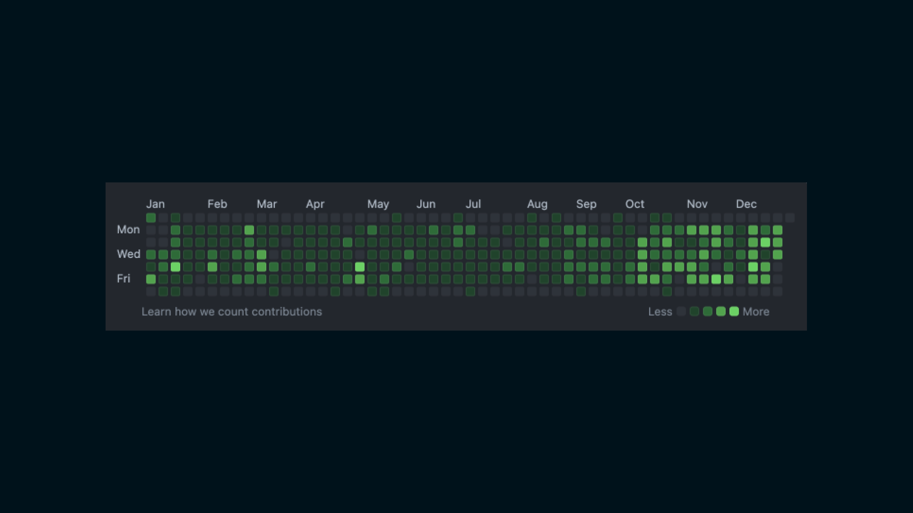

2023年が数日で終わるので反省も兼ねて振り返りします  
2022年の振り返りは[こちら](../about2022/)

## Overview 👀
- 一年間会社を辞めるようなこともなくiOSエンジニアとしてスキル成長した
- 趣味サウナーになった
- 東京の美味しいお店や住んでる地域の憩いの場を発見した

今年はなんといっても、iOSエンジニアとして無事軌道に乗れた一年だった気がする。去年新卒として入社しiOSエンジニアとしてデビューした際は分からないことも多く、正直かなり焦っていた部分もあったが、今年は自分のiOSエンジニアとしてどういった成長をしていきたいのかより具体的になったと思う。とはいえまだまだ求められているレベルには遠く及ばないので来年も精進します！

幼少期からサウナは好きで温泉ついでに入っていたが、サウナのために行くほどではなかった。5月に名古屋〜北陸旅行をした際に毎日温泉とサウナに入っていたら趣味サウナーとして目覚めてしまった。好きなサウナは「サウナ東京」、おすすめしたいサウナは広島の尾道にある「尾道ふれあいの里」、次に行きたいサウナは「吉祥寺 MONSTER SAUNA」  
サウナだけで記事書けそうな雰囲気すらあるのでこの辺で、、、 💦

## Good and Not good products 🎒
今年購入・契約して良かった物、悪かった物

### Good products 👍
物ではないが個人的に今年はチョコザップに入会して、いい意味で私生活が変化した一年だった。半年で体脂肪率4%減、筋肉増量したことで体型が細くなった。複数店舗が家の近くにあるおかげで、どのルートで家に帰っても必ず寄れることも継続出来ているポイントだと思う。

レッグプレスなど下半身トレーニングの器具の重量が物足りなくなりつつあるので、ぜひともプレートの追加をしてほしいところ 💪

### Not good products 👎
ものすごく悪いわけではないが、「Xiaomi Redmi buds Pro 4」は購入して少し残念だった。国内販売されたものではなく中国からゴニョゴニョして入手したこともあるかもしれないが、デバイスとの接続不良やノイズキャンセリングが急に効かなくなる、バッテリー的にはまだあるのに応答しなくなったり、外部のノイズに対して弱くプツプツと途切れることが頻発している。

国内向けの商品でも同様の症状があるらしく、ファームウェアのアップデートなどで解決するのであれば改善してほしいところ 🙏

## SNS and development commitment 📡

- X
    - Post：379（👇 171）
    - Impression：40,529（👇 86,857）
- Github
    - Contributions：3,052（👇 217）

Xはほとんど利用しなくなりましたね、、、  
開発は一時期SquashMergeで運用していた都合でコミット数は減っていますがマージしたPR数だけでも300個近くあるので昨年に比べてもかなり開発量が多くなりました。

## 2024年はこんな一年にしたい ⛩️
仕事で言えばさらなるスキル向上、私生活でいえばもっとアクティブに活動していきたいですね 🔥
