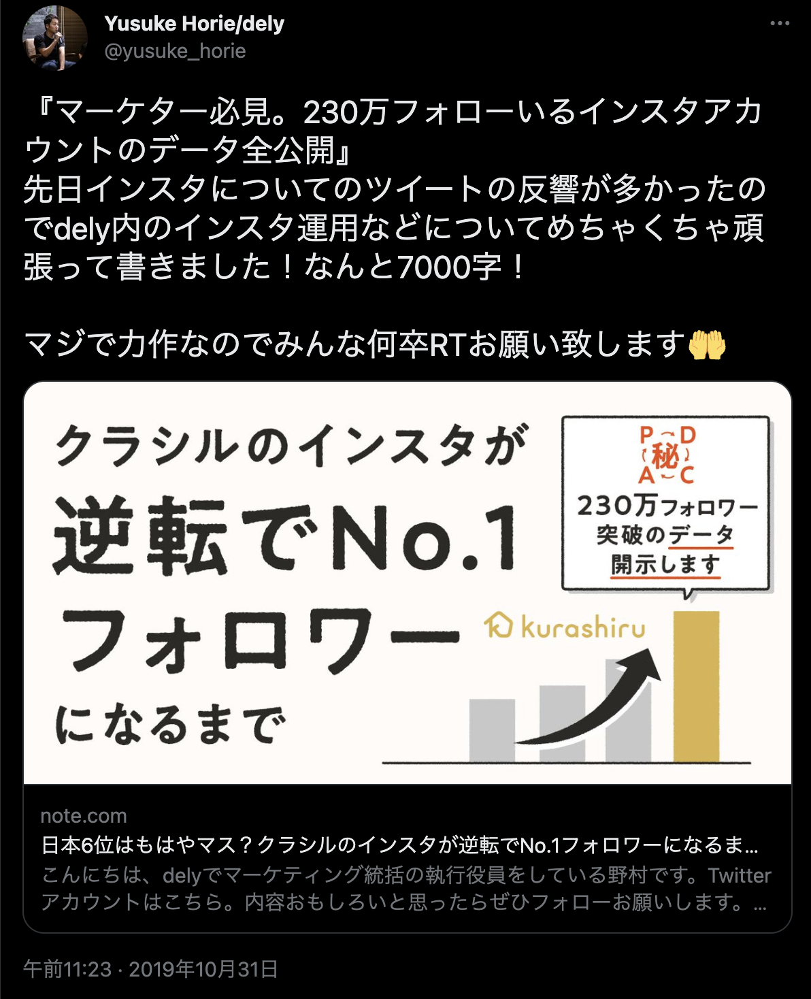

2022年4月1日に国内最大のレシピプラットフォーム“クラシル”を運営する dely株式会社 へ入社しました

なぜ新卒でベンチャー企業を選んだのか、完全未経験なのにモバイルエンジニアになったのか、今後何を目指していくのか、など深ぼっていけたらと思います！

## Who am I
小学生のころからインターネットにふれあい、高校生のころからブログ運営を行っていました。大学に入ってから本格的にWebサービスを開発しはじめ、卒業研究では中小製造業向け生産管理システムを開発しました。個人開発で一番規模の大きな成果物がこのシステムで、現在でも引き継がれて運用されているらしいです！

高校生のときからAIなどの先端技術、ITベンチャーなどスタートアップに興味がありビジコンなどを見に行くこともありましたが、殻を破りきれず出場することはありませんでした…しかしインターンやIT系のイベントを通じて身近に情報収集とアクションを行うこと、話す相手を作る努力だけは継続的に続けていました

## delyとの出会い
delyとの出会いは、とある起業家がたまたまリツイートしていた記事に強く興味を惹かれたからです！

実際に回ってきたツイート：
https://twitter.com/yusuke_horie/status/1189729555545612290

その当時は実家暮らしで毎日の献立に困ることはなかったため、料理が掲載されているサービスといえばクックパッドしか知らなかったのですが、この記事を見てクラシルに対する世間の熱量と次の時代の始まりを感じました

2019年11月にこの記事を読んで約1年、就活イベントでたまたま面談をする機会がありいくつかの選考の後、21年の1月に内定を承諾しました

内定を承諾するまでの就職活動などは[別の記事](../job-hunting/)にまとめているので、つたない文章ですが時間があれば覗いてみていただけると🙏

## delyへの入社
幼稚園のころに初めて包丁を握り、創作料理という名の練習をして以来、料理に対する関心と興味があり、毎日美味しそうな動画を見ながら仕事ができるという安易な考えと？20代のうちに身に着けたい、身を置きたい環境にマッチしていたため入社を決意しました

### 入社理由 1：変化の速度と角度
19年の秋くらいは料理動画でインスタグラムのフォロワーを爆増させていたかと思えば、面談時にはチラシなどのリアル店舗とデジタルをつなげるリテールプラットフォームの構築、オンラインショッピングのコマース領域にも進出するなど、環境が変わる速度の速さ、既存の環境を改変しながら突き進む変化角度の高さと、より早い速度で進化していくチーム・人と一緒に仕事がしたい！と思いました

### 入社理由 2：情報の透明性とデータアクセス権
基本的にはオープンなスタンスで生活していることや、DMMのインターンを受けたこともあり、情報の透明性にはかなり強いこだわりがありました。面談時に似たような質問を色々な人にしたところ、どうやらSlackのチャンネル数が多すぎる＆一日の情報量が多すぎてとても全部は追いきれないという幸せな？環境があるとのことでした。

また、エンジニアだとしても経営的な視点・接点は常に持っておきたいと考えていたのですが、サービスのログや売上など基本的にどの役職でもアクセスできる権限があるとのことで、こちらも希望通りでした。

将来的にはPdMなど経営的な面を勉強したいので、役職にとらわれること無く勉強できる環境が初めから整っていることにとても感動しました！

### 入社理由 3：ファーストキャリアへの思い
「20代のうちはチャンスがある限り全部やる」「QOL・ワークライフバランスは二の次」

という考えで生活しているので、多少激務・カオスが予想される会社に行こうと考えていました。基本的にはエンジニア＆経営のハイブリッドマインドの人間だと考えているので20代のうちに色々と種を蒔いてみて自分の得意な領域を探しつつ、初めはエンジニアとして生活することが直近のキャリア戦略です。

（正直かなり悩みましたが、内定を頂いた別の会社はいわゆる超大手で超激務は予想されますが、経営的な接点のある話ができるまでに時間がかかりすぎること、アクセスできるデータが新卒〜5年までは少なすぎることなどがあり辞退しました）

## モバイルエンジニアとしての一歩
学生時代はサーバ〜Webフロントを主にやっていましたが大したスキルも持っていなかったので、面談等でどのポジションに入りたいか相談を受けた際に「なんでもやります！勉強します」と言ったところiOSエンジニアに決まりました

それまでGoogler, Androidオタクだったので正直悩みましたが、0.5秒くらいで「やります」と返事をした気がします。記憶にないです。

その他にも色々と、社長から感じるオーラ、感覚的なものとかいろいろありますが、上手く言語化できないので省略しますw

とりあえず新卒エンジニアとして「やっていき」の精神を大切に挑戦してみます🔥
