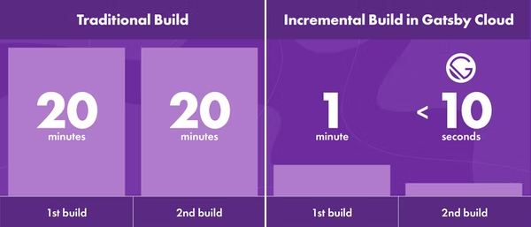

Gatsby.js の Version4 から対応した変更差分ビルド方式である「[Incremental Build](https://www.gatsbyjs.com/blog/2020-04-22-announcing-incremental-builds/)」をGitHub Actionsで実行する方法について解説します。

## Incremental Build とは？
これまでのGatsby.jsはデプロイ時のビルド等の本番環境向けビルドの場合はどれか一つのファイルが変更されるとすべてのファイルをビルドし直す方法で構築されていました。そのため、規模が大きいサイトやブログなどではビルド時間が20分を超える場合もあるほどコストがかかるものでした。

これを解決すべく開発されたのが、 Incremental Build です。

Incremental Build ではキャッシュ（Cache）の活用とビルドの効率化により劇的にビルド時間を短縮することに成功しています。



Incremental Build をGitHub Actions等のCIで利用する場合はキャッシュの機能を用いて `public` と `.cache` を維持しておく必要があります。

## GitHub Actions で Incremental Build を利用する方法
GitHub Actionsのワークフローを編集します。

```yaml:title=workflow.yml
name: Gatsby build

on:
  push:
    branches:
      - main

jobs:
  build_sync:
    name: Package install / Build
    runs-on: ubuntu-latest
    steps:
      - uses: actions/checkout@v2
      - uses: actions/setup-node@v2
        with:
          node-version: '14'
          cache: 'npm'
      - name: npm install
        run: npm ci
      - name: Caching Gatsby
        id: gatsby-cache-build
        uses: actions/cache@v2
        with:
          path: |
            public
            .cache
          key: ${{ runner.os }}-gatsby-build-${{ github.run_id }}
          restore-keys: |
            ${{ runner.os }}-gatsby-build-
      - name: npm build
        run: npm run build --if-present
```

注目すべき点は `Caching Gatsby` の部分です。ここでは、ビルドすると生成される `public` ディレクトリと `.cache` ディレクトリをキャッシュします。GitHub Actionsの制約上、たしか30日で破棄されますが、30日間のうちに同じワークフローを実行すると今回利用したい「Incremental Build」が効果を発揮します。

↓ キャッシュが存在しない場合のビルド時間(3:19s) [workflow](https://github.com/psbss/blog/actions#:~:text=Merge%20pull%20request%20%2391%20from%20psbss/article/covid19%2D0525)


↓ キャッシュを利用した Incremental Build のビルド時間(1:42s) [workflow](https://github.com/psbss/blog/actions#:~:text=Merge%20pull%20request%20%2389%20from%20psbss/package/update%2D20220601)


比較的軽量な私のブログでも約1分半の差がでることが判明しました！

## 補足
GitHub Actions公式が開発している Node.js 実行環境を作成する setup-node もv2からキャッシュ機能が実装されたので以下の様にパッケージマネージャの種類を記載しておくといい感じにキャッシュしてくれます（20秒くらい早くなりました）。

```yaml:title=workflow.yml
- uses: actions/setup-node@v2
  with:
    node-version: '14'
    cache: 'npm'
```

現時点（2022/06/05）だと `npm, yarn, pnpm` に対応しているみたいです（[Doc](https://github.com/actions/setup-node/tree/eeb10cff27034e7acf239c5d29f62154018672fd)）
