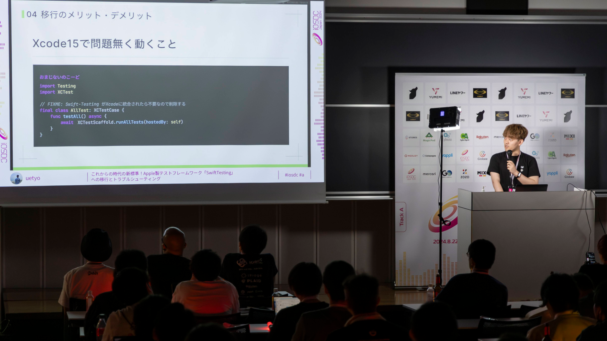

`youtube:https://www.youtube.com/embed/54EsJ10WP4M?si=SEcIcnajr5FDVI0D`

先日、国内最大級のiOSカンファレンスであるiOSDC2024にルーキーズLT枠として登壇した記事を投稿しました。

今年のWWDCにて正式に公開された SwfitTesting をチームに導入することを早期に意思決定したので、その移行作業や移行時に直面した問題のトラブルシューティングを発表しました。

発表時点でクラシルリワードのテストコード全体の 90% を移行完了しました。残りの10％については別途問題があり徐々に移行している状況です。

記事はこちら：[iOSDC Japan 2024 に登壇しました](https://zenn.dev/dely_jp/articles/0a5ab5913a76e3)
