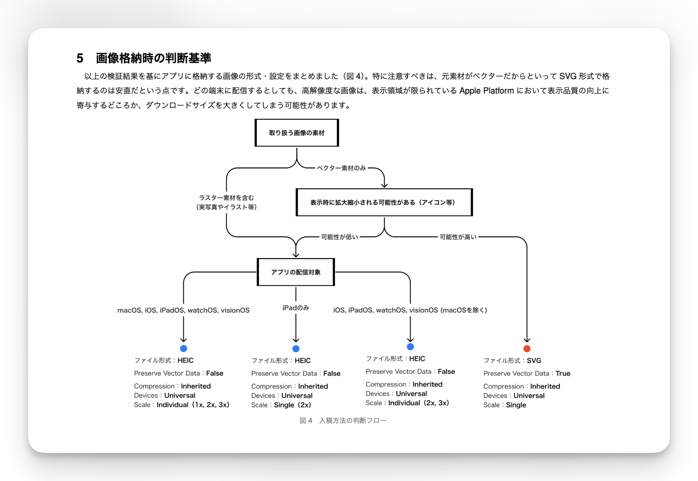

2026年9月11日(金)〜13日(日)に東京、有明セントラルタワーホール＆カンファレンスにて[iOSDC Japan 2026](https://iosdc.jp/2026/)が開催され、カンファレンス入場時に配布されたパンフレットに私の記事が掲載されました。パンフレット記事の執筆は今回が初めてとなります。なお、パンフレット記事及び、調査に用いたプロジェクトはこちらの[GitHub Repository](https://github.com/psbss/iOSDC-2026-Booklet)にて公開しています。

## パンフレット記事のテーマと背景
私は以前より、iOSアプリに格納する画像ファイルの形式や、AssetCatalogの入稿オプションがアプリ容量やパフォーマンスにどういった影響を与えるのか気になっていました。しかし、周囲のエンジニアに相談しても三者三様の回答があり、確信を持った考えを持ち合わせない状況が続いていました。Human Interface Guideline においても[画像格納のページ](https://developer.apple.com/design/human-interface-guidelines/images)は存在しており、ベストプラクティスとして参考になります。しかし、実際の開発業務で利用する画像フォーマットの判断軸としては、抽象度が高いように感じました。

そんな疑問を持ちつつ開発をしていたのですが、半年ほど前、業務にて開発しているアプリの容量が突然、約50MB肥大化する問題が発生しました。この際は、変更内容よりおおよそ原因が判明し、ユーザへの影響も極わずかで済みました。しかし、画像リソースの追加は日常的に行われる内容のため、再発する可能性が極めて高いと考え、今回の調査を実施しました。

## 記事の内容
パンフレット記事のタイトルは「今どきの画像アセット入稿：たった1枚の画像でアプリサイズが50MB増えた失敗から学ぶ最適化方法」です。

本記事では、アプリに格納した画像がAppStoreで配信されるまでの大まかな処理について触れた後、200種類ほどのプロジェクトで検証した結果を元に格納する画像の種類や用途に応じた最適な形を深堀りました。さらに、アプリサイズの増加を検知するため、実際に運用している方法を記載しました。

検証に用いた画像は全て同じ素材ですが、色々な形式で書き出したものを利用しており、AssetCatalogに格納する際に設定するオプションに関しても様々な組み合わせを試しました。

今回の検証結果を元に用途に応じた簡易フローチャートも用意しました。

## パンフレット記事を執筆した感想
検証自体はずいぶん早い段階でまとまっていたものの、業務との兼ね合いや執筆環境の構築に思ったほか苦しみました。特に、執筆環境に関しては2025年に[栗山徹](https://x.com/kotetu)さんの「実体験から学ぶ！ iOSDC Japan パンフレット記事入稿のコツ」という記事を参考にしつつ構築しました。

今回は執筆環境としてRe:VIEWを利用しました。限られた時間の中で内容はもちろん、せっかくなら本みたいな感じにしたい！と思い立ったのが決め手でした。ところが、いざ実際に書き始めてみるとページ数が限定されている環境かつ、画像を多用する必要があるテーマ故に組版の特殊な設定が厄介でした（便利なんですが、難しい）。

また、完全に私が悪いんですが、CfPでは4ページだったものの、筆が乗りすぎてしまい8ページも執筆していました！内容を圧縮することで6ページにして提出したものの、入稿期限に差し迫っていたこともあり（事前に相談してほしいと記載があったが失念していました…）当初のページ数に削減する事になりました。

文章を削減するのは現実的ではなかったため、余白や画像サイズ、フォントサイズを無理くり調整したのですが、執筆環境が独特だった故に、AIを利用していても調整にかなりの時間が必要でした（トータル2日くらい / AIが調整してはスクショで確認するという作業を頑張っていました）。この細かい組版の調整はページ数が限られているパンフレットであれば、画像の回り込み処理は面倒なものの、いっそのことFigma等のUIツールでやってしまったほうが簡単かもしれません。

そんなこんなで入稿が遅くなってしまいました 🙇

入稿して約2ヶ月、内容もぼんやり忘れてきた今日このごろですが、見返してみると内容を詰め込みすぎですね…もっと簡潔に要点を絞った形にできたような気がします。次回もし機会があればもっと上手に執筆できるような気がします！

来年のiOSDCが楽しみです 👏

## リンク
パンフレット記事・調査に用いたプロジェクト：[今どきの画像アセット入稿：たった1枚の画像でアプリサイズが50MB増えた失敗から学ぶ最適化方法](https://github.com/psbss/iOSDC-2026-Booklet)
