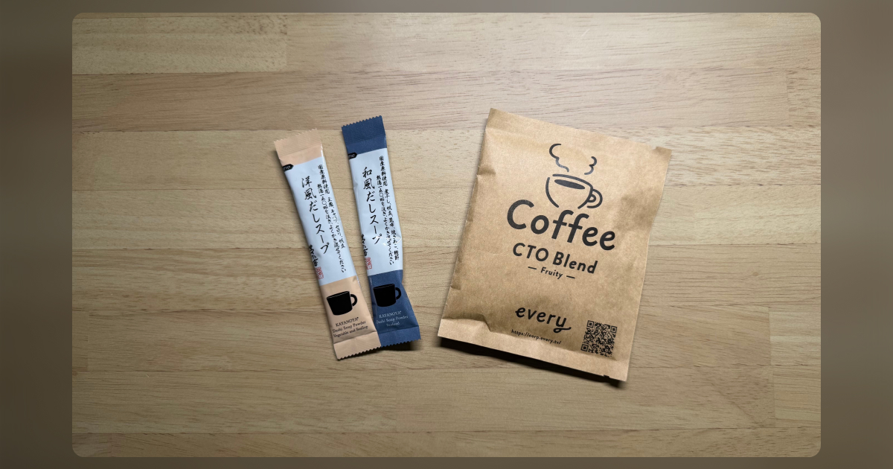
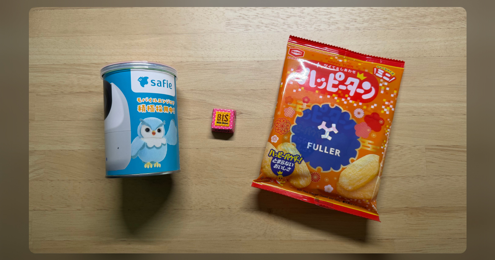
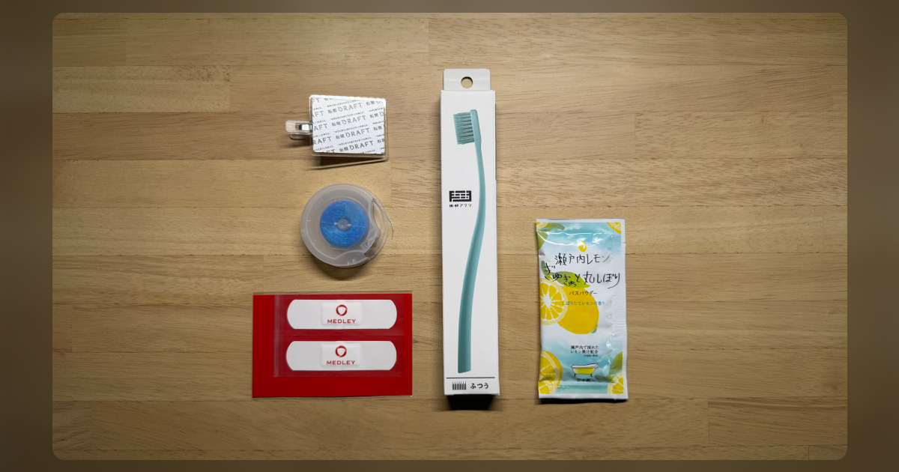
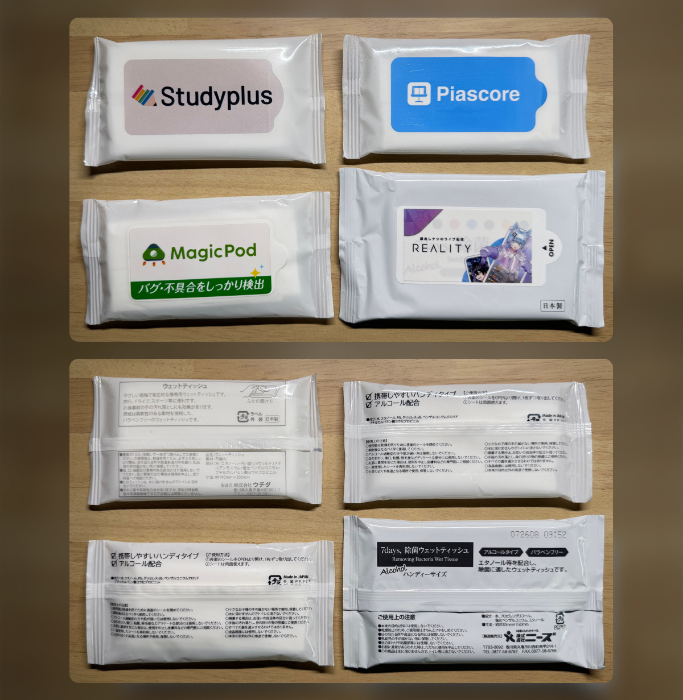
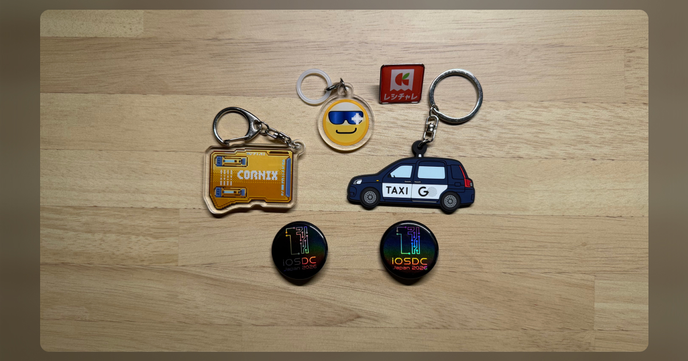
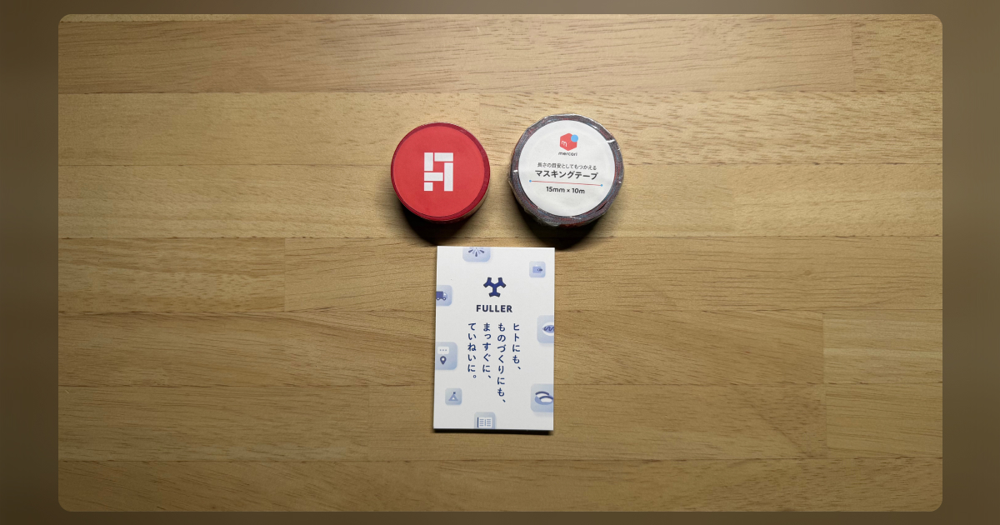
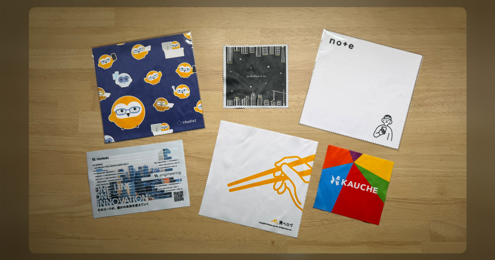
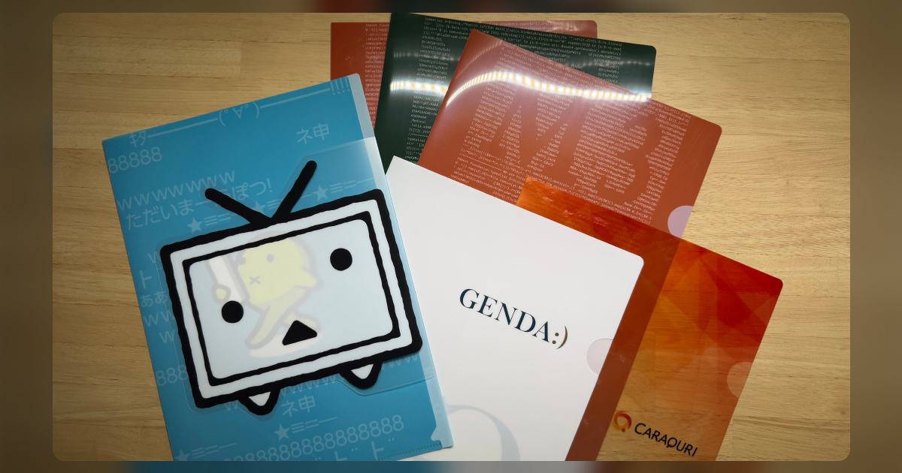
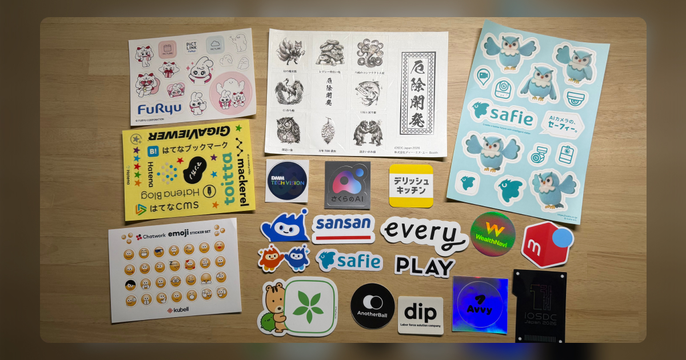
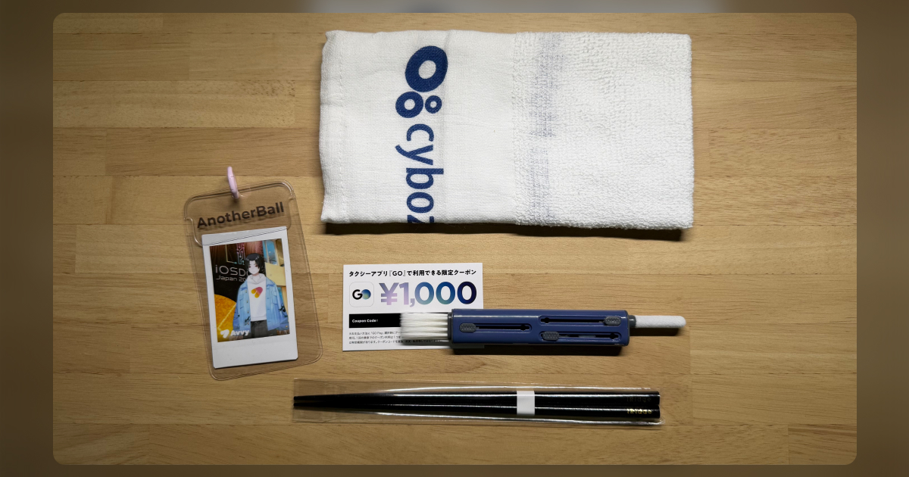

カンファレンスノベルティ（Swag）は頂く機会こそ多いものの、企業の方にフィードバックする機会は少ないように感じます。そのため、お互いに手探り状態で渡す・受け取ることが多いのではないかと思います。この記事が何らかの参考になれば幸いです。

※ ここからは、あくまで参加者としての個人的な感想です。

## 今回頂いたノベルティの紹介

### 食料品
食品のノベルティは、カンファレンスや会場のルールによって事前に制限されることがあったり、アレルギーなどへの配慮が必要になる一方で、持ち帰りやすく、その場や自宅で楽しめるのが魅力だと感じました。

### 洗面用品
今回頂いたノベルティの中で欲しかった！とおもったものが、こちらの洗面用品でした。特に少し良い歯ブラシはなんぼあってもいいですからね。近いうちに利用したいと思います。

### ウェットティッシュ
今回もいくつかのウェットティッシュを頂きました。机の回りを掃除したりするときなど、ちょっとした時に重宝するので毎回ありがたく利用させて頂いてます！

### キーホルダー・バッジ
個人的にキーホルダーやバッジをつける機会がほぼ全くないため悩んでいます。傘の目印キーホルダーは最近急速に流行ってきておりセンスが光る一品だなと思いました。

### 文具
今回も色々な文具を頂きました。以前はボールペンや蛍光ペンなど書くものを大量に頂いていましたが、iOSエンジニア故に書き仕事も少なかったため、無くなったのはいい傾向だなと思いました。

最近ディスプレイクロスを頂く機会が本当に多いです。嵩張らない点で持ち帰りやすいのですが、サイズが異なる物を何枚も頂くとなると利用後の保管に困ってしまう点は悩ましいですね。

クリアファイルも同様に、身近なところで利用するケースがあまりなく、利用したいケースでもクリアなものが必要だったりと悩ましいですね。

### シール
今回も大量に頂きました。正直なところ、これまでは用途に困っており、ウェットティッシュの箱に貼り付けたりとしていたのですが、最近は見開きノートにペタペタとコラージュして楽しませて頂いています。幼少期を思い出しますね。

### その他
いずれのジャンルにも属さないですが、イヤホンの掃除道具やお箸は良いなと思いました。複数個頂くと用途に困るかと思いますが、これまでにないノベルティとして非常に面白いなと思いました！重宝させて頂きます。

チェキはプロダクトを体験したうえで、印刷して手元に残る点で面白いなと思いました！ブースで限られた時間だったのでキャラメイクをこだれなかったのが惜しまれます🥺

## 個人的に嬉しかったノベルティの傾向
ここまで書いてきた感想を、自分なりの判断軸として整理してみました。ノベルティを検討される際の材料のひとつになれば幸いです。

### 消耗品は重複しても困らない
洗面用品・ウェットティッシュ・食料品のように、使えば無くなるものは複数個頂いても使い切れるため、受け取る側としてもありがたいです。

### プロダクト体験とセットになっていると記憶に残る
ブースでプロダクトを体験し、その結果が手元に残る形のノベルティは、モノそのもの以上に体験ごと記憶に残りました。ノベルティ単体ではなく、ブースでの体験を思い出せるため非常に印象に残っています。
