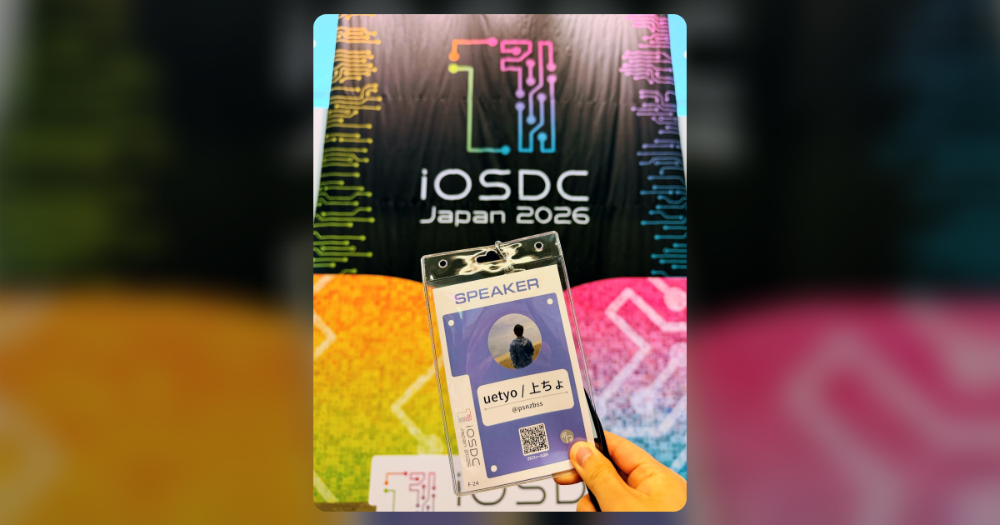
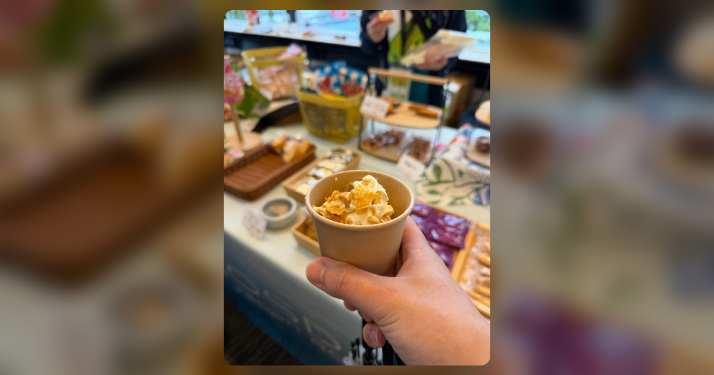
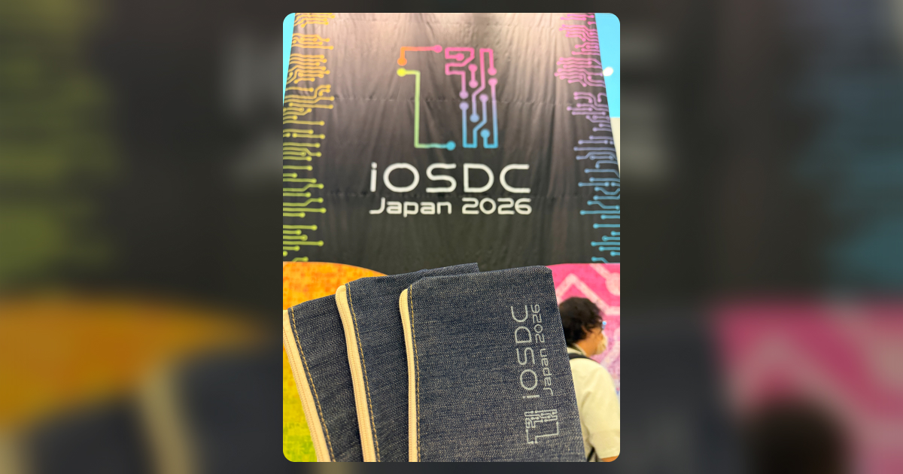
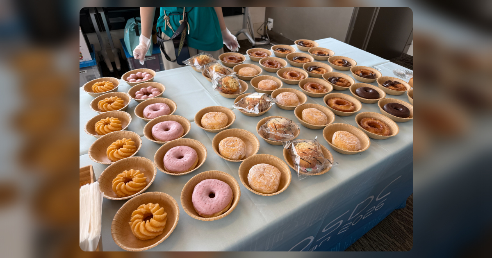
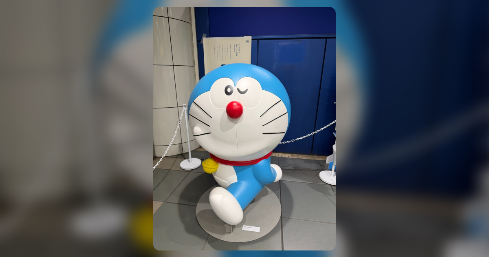

I did Blog!  
今年も終わってしまったので悲しいような嬉しいような…

2026年9月11日(金)〜13日(日)に東京、有明セントラルタワーホール＆カンファレンスにて開催された[iOSDC Japan 2026](https://iosdc.jp/2026/)に参加しました。iOSDCへの参加は4年連続4回目、スピーカーとしては2回目の参加となりました。

※ この記事は参加記録も兼ねているので長いです  
※ この記事で扱うトークは参加したもののうち一部です

## パンフレット記事の執筆
毎年いくつかのCfPを提出するiOSDCですが、今年はパンフレット記事で採択されました 🙌 記事の内容や執筆した感想については「[iOSDC Japan 2026にてパンフレット記事を寄稿しました](../iosdc-2026-booklet/) 」こちらで詳しく掲載していますので、ぜひご覧ください！

## Day0 - 9月11日(金)
業務を早めに切り上げ、いざ有明へ。生憎の天気でしたが国際展示場駅を出るとものすごい人だかりでした。どうやら、国際展示場にて国際物流総合展が開催されていたようです（行きたかった）。会場は昨年と同様のため特に迷うこと無くチェックイン出来ました。

大量のノベルティを受け取りつつ最初に拝聴したのは[Toshさん](https://twitter.com/tosh_3)の「[Xcodeの「Apply」ボタンの裏側 ~Swiftコンパイラのfix-itの仕組み ~](https://fortee.jp/iosdc-japan-2026/proposal/6f230e28-c1f1-4b09-ab51-c8a5a9a28adc)」でした。以前から機械的な修正だなと感じていたApply機能ですが、これがSwiftコンパイラによって推論時に提供されているというのは初耳でした！コンパイラが確からしいと検証した内容のみApplyボタン（fix-it）を提供する故に、人が見て簡単な変更が fix-it 表示されない理由も理解できました。

次は[ayakixさん](https://x.com/ayakix)の「[空から降ってくるバイナリを読む〜数千円のハードで作る、自分だけの飛行機トラッカー〜](https://fortee.jp/iosdc-japan-2026/proposal/f44b12d0-684f-4805-b88b-c0bd024b7924)」を拝聴しました。比較的空港に近いところに住んでいることもありFlightradar24を開くことが多いのですが、どうやって飛行機から発せられるADS-Bシグナルを取得するのか気になっていました。ノギスを利用した精度改善やバイナリの構成からどういったソフトウェア的な処理を行うのか興味深いトークでした。

この日最後のトークは[kntkさん](https://x.com/kntkymt)の「[App Intentsのビルドプロセスを支える技術](https://fortee.jp/iosdc-japan-2026/proposal/d71cd5fd-c341-4a15-bd5d-f2f427b1325f)」を拝聴しました。appintentsmetadataprocessorという処理機構で特殊なメタデータが生成されることで端末に認識されるとのこと。Xcode26からはマルチモジュール構成に正式対応し、Static Link、Dynamic Linkする場合の処理の違いや、QAで名称が変更された場合のユーザの端末から消えないようにする方法など低レイヤーの詳しい話が聞けて良かったです。

そんなDay0、夜はその場にいた知人と20人くらいの飲み会が開催され初日からアクセルを踏んだiOSDC 2026が開幕しました🍻

余談ですが、どうして初日はDay0なんですかね…？

## Day1 - 9月12日(土)
案の定、初日にアクセルを踏みすぎた結果、Day1は10時過ぎの会場到着でした。なお、体調は不調寄りです😇 （活力を助けてくれたハーゲンダッツに感謝）

Day1の午前中は[メルカリモバイルのeSIMアクティベーションの話](https://fortee.jp/iosdc-japan-2026/proposal/30c1177b-724c-4fd2-9f5e-4b329cf22ef4)や[au Payの開発](https://fortee.jp/iosdc-japan-2026/proposal/98c13ae7-7382-4949-92ec-25e847df5065)に関するトークを拝聴しました。

メルカリモバイルのWebとネイティブを行き来する設計はOSの制約などにより複雑になりがちだなと思いました。アプリ内に独自のブラウザを設けることで多少はやりやすくなりそうだと思ったんですが、そんなこともないんですかね…？

au Payが少し前までiOS12までサポートしていたと聞いた時は震えました。トークの内容は組織構造や文化的な側面が強い課題かなと感じましたが、登壇者の方が[Working Out Loud](https://blog.studysapuri.jp/entry/2018/11/14/working-out-loud)(WOL)で仕事をしはじめたことで状況が改善されてきたという点が興味深かったです。

昼食後はブースを回りきり、[kanekoさん](https://twitter.com/ska_nekoo)の「[ワンバンクのApple Pay対応の裏側: PassKitでつくるカード追加体験](https://fortee.jp/iosdc-japan-2026/proposal/6851108f-3482-4701-96aa-f793b516e290)」と[nakamuuuさん](https://twitter.com/chickmuuu)の「[「守り」で活用するオンデバイスLLM 〜写ってはいけないを総力戦で防ぐ〜](https://fortee.jp/iosdc-japan-2026/proposal/b1e8bd3f-2229-4422-b6ad-cc1facb01595)」を応援しました。お二人とも普段から近くでやり取りしているチームメンバーですが、登壇している姿を見るのは刺激を貰えていいですね！

Day1最後はルーキーズLTを見ました。コメントは長くなるので1行で（一部のみ）。

- [目が見えなくてもXcodeやApp Store Connectは操作できる？](https://fortee.jp/iosdc-japan-2026/proposal/7c8adc71-2155-4ff0-b20a-86aecd8c97e0)：VoiceOverの実演を初めて見ました。蔑ろにしがちなアクセシビリティ対応ですが、エンジニアの怠慢によって利用者の可能性を奪ってしまうかもしれないことは改めて考える必要があると感じました。
- [Walletはチケットだけじゃない？オリジナルのプロフィールカードをつくってみる](https://fortee.jp/iosdc-japan-2026/proposal/be9fa1a0-4009-4d8f-b8a5-423fe83450ee)：さきさんの登壇！iOS27からウォレットパスをある程度自由に追加できるようになったのでプロフィールカードをウォレットに登録してみよう、というトーク。私もdポイントなどのポイントカードを設定して便利に利用してます。Apple Watchにも同期されるのがとてもいいですね。
- [採択されなくてもiOSDCのLT大会を体験したい！そんなアプリを作りました](https://fortee.jp/iosdc-japan-2026/proposal/aba4ef7b-9489-4e1d-8a09-e386837d5be6)：ととさんの登壇！僕も銅鑼の音を使いたいケースが稀にあって気になっていたところに良さそうなアプリが公開されたので使ってみようと思いました！
- [鉄道信号設備の保守経験から考える Swift Concurrency のフェイルセーフ設計](https://fortee.jp/iosdc-japan-2026/proposal/a8081a83-234f-42f1-b632-3de4617790ba)：Swift Concurrencyと鉄道の信号設備をかけ合わせた発想に脱帽でした。👈️ ヨシ！
- [綺麗に撮れすぎるスマホカメラからブレを取り戻す](https://fortee.jp/iosdc-japan-2026/proposal/32fb9648-3596-4302-a1bd-c00627701b4c)：こちらも発想に脱帽でした。躍動感を出すためには必須なブレを人力で撮ろうとする姿は面白かったですw

自宅で[Ryommさん](https://x.com/__ryomm)の「[巨大モノリシックアプリモダン化大作戦](https://fortee.jp/iosdc-japan-2026/proposal/a9f0542d-d99a-4760-90e7-1ab2941b39af)」も視聴しました。僕も色々な巨大なアプリを触ってきたんですが、AIがある時代とはいえ利用できるコストは無制限ではないですし、コンテキスト管理や効率的なスキルの整備、明示的な方針が必要なリアーキテクチャを含むリファクタリングはまだまだ難しいなと感じました。いっその事ゼロから作り直せればいいんですが、それはそれで大変ですもんね…

## Day2 - 9月13日(日)
少し疲れを感じながら参加したDay2の最初は[まつじ🦌さん](https://twitter.com/mtj_j)の「[アプリをもっと"iOSアプリっぽく"する小さな工夫](https://fortee.jp/iosdc-japan-2026/proposal/7d8bec41-6b1a-4343-9e7f-3f65abdf596c)」を拝聴しました。今回のiOSDCにおいて最も心を動かされたトークの一つです。

トーク内で「ユーザーは複数のアプリを同時に利用している。デザイン言語であるHIGが統一されていればアプリ間の境界があいまいに感じるが、そうではないアプリが入っていると障壁となる」という言葉が刺さりました。自転車の動きを例に物理法則に則ったUIトランジションに関する説明は非常に分かりやすかったです。これまで気にかけていなかったAppleの細かいこだわりを、自分も考えてみようと思う非常に良いトークでした。

参考例として提示されたWWDC2018の「[Designing Fluid Interfaces / 滑らかなインターフェイスをデザインする](https://developer.apple.com/jp/videos/play/wwdc2018/803/)」動画は見直しが必要ですね！

ランチ後は[koherさん](https://twitter.com/koher)の「[Heart of Swift Concurrency](https://fortee.jp/iosdc-japan-2026/proposal/a82899ff-52ef-4906-85d6-20137312bcd3)」を拝聴しました。私もSwift Concurrencyは永久に勉強しているのですが、Swift ConcurrencyのHeartの部分が `Data race safety` というのは完全に同意でした。Swift 6以前やRxSwift等のリアクティブプログラミング、多言語のアプローチとは思想が異なるため取っ付きづらさはありつつも、コンパイラでこの制御を実現しているという点は感動すら覚えます。

これまでも曖昧に感じていたSwift 6.2以降のアーキテクチャ設計、Sendableの付与、Actor境界などの用語について非常に理解しやすいトークでした。「Concurrency の Heart を理解していれば解決できる」という発言がありましたが、これは本当ですか…ですね。

トークの最後に、新しいプロジェクトを開始する際は「Default Actor Isolation: nonisolated」がオススメとの話がありましたが、自分は逆にMainActorにしておいて特定モジュール下の関数で `@concurrent` すればいいのでは、と考えていたためびっくりしました。たしかに初心者ならともかく、複数人でスケールしていくプロジェクトであればnonisolatedにしておいたほうが後から変更しようとした際に負荷が少ないかもですね。

LT前最後のトークは[ひなっこさん](https://twitter.com/hinakkograshi)の「[大幅なOSアップデートが来ても怖くない！〜Liquid Glass対応でエンジニアとして組織を動かすために意識したこと〜](https://fortee.jp/iosdc-japan-2026/proposal/ba55af4b-c23b-409d-a5d8-d0129939ad2a)」を拝聴しました。私も1年程前に[LiquidGlassの対応をした](https://blog.smartbank.co.jp/entry/liquid-glass)ので組織やステークホルダーと共にプロジェクトを進める必要があるものとは認識していましたが、アプリの規模や扱っているもの（証券）故の難しさが感じ取れる内容でした。お疲れさまでした！

最後は毎年恒例、大爆笑のLT会を見ました。こちらもコメントは長くなるので1行で（一部のみ）。

- [iOSDCのペンライトを自動制御したい！](https://fortee.jp/iosdc-japan-2026/proposal/e3e8e210-c405-45f4-a101-5baed82df109)：アッキーさん（AkkyLab）の登壇！先日、ピューロランドのペンライトは制御できる、という話を聞いた直後だったので興味深いLTでした。前の方でペンライトを振っていた人のうち1人は私です。
- [Minecraft JavaのMODをSwiftで作る](https://fortee.jp/iosdc-japan-2026/proposal/7022bcb3-ac67-4a6f-95e9-429206d40e66)：Swift-Javeが登場して使い所はどこかなと思っていたところにまさかのマイクラのMODが出てきてびっくりしました。たしかにマイクラといえば統合版かJava版ですよね。発想が凄い。
- [手動確認はもう限界 〜XCUITestでCustom URL Schemeの遷移を起動種別ごとに自動テストする〜](https://fortee.jp/iosdc-japan-2026/proposal/7d125d0b-f834-49c5-8431-11cf313be2ff)：こちらも発想が天才的でした。自分もCustomURLやUniversalLinkの挙動をテストするためにE2Eをセットアップした経験がありますが、動作速度と安定性が微妙だったので困っていました。
- [大喜利で理解するLLM as a Judge](https://fortee.jp/iosdc-japan-2026/proposal/1bb6f1b8-5bc2-484f-8101-950d3b05ba88)：スマートバンクから3人目の登壇者であるRocknameさん！このトークは準備期間も含めて本当に涙無しでは語れないほど大変な様子でしたので、当日とてもウケていて本当に安心しました。内容もそうですが、あの場で、最後のトリとして参加者の回答を大喜利として発表するハートの強さは、ものすごいものを見せてもらったなと思います！

その後の懇親会で食べたシャインマスカットのアミューズブッシュやヒレ肉のローストは感動的に美味しかったです😋 また、非公式ながら70人程集まった二次会も最高でした！freddiさん、岸川さん企画ありがとうございます🙌

## iOSDCチャレンジ
今年はiOSDCチャレンジを頑張ると決めていたので最初から駆け足で色々回りました。ブース来場特典のスタンプやiOSDCトークン探しをした結果、特典ガチャを9回回しました。特賞が3つ、1等が2つ、バッジが4つでした。トークン探しも頑張ってたんですが26,000点と最大値の半分くらいしか集めれませんでした。

幕間の動画は気にもしてなかったので来年こそは取りきりたいですね（ブースで直接獲得できるトークンは半ばあきらめていたのでどうにかしたい）

## カンファレンスについて
### 採択トークについて
採択された方や採択基準にも関係する話なので大きな声では言えないのですが、個人的にはかなり良かったと思いました。

カンファレンスや勉強会の運営に関わっている身として近年のAIは無視できない存在です。たしかに、これまでよりも格段に実装しやすくなり、スライド資料もスクリプトもほとんど自動で作れるようになりました。しかし、そういったトークは期待値をすり合わすという点で受け手も技術を要することが多いように感じます。幸い今回のiOSDCでは（自分が見た中では）そういったトークがほとんどなかったように思います。

また、iOS以外の技術、とくにハードウェアが関わるトークが多いようにも感じましたが、こちらは個人的には刺さらなかったです。

### ケータリングやドリンクについて
今年も圧倒的な物量で終始満たされていました！特に念願だったドーナツを2日とも食べることができてよかったです。

例年は残暑で厳しい環境での開催ですが、今年は雨模様だったこともあり、ハーゲンダッツアイスの輝きが今一つだった点は惜しまれます。個包装のお菓子やビール🍺、潤沢なソフトドリンクは相変わらず最高でした！

ところで、アイスやドリンクの提供に関して保健所とか会場規約によるメーカー指定制限とかってあったんでしょうか…？

### ノベルティについて
今年はノベルティについても感想を書きました。  
後ほどアップロードします。

## 総評
今年も最高に楽しい3日間でした！来年も参加します🙌

