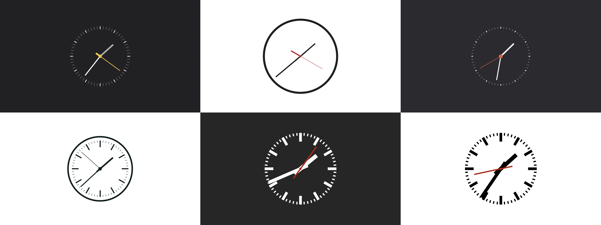
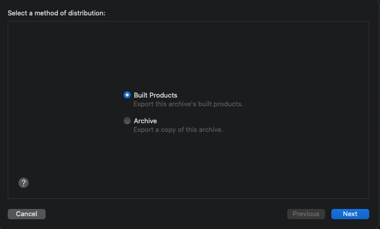
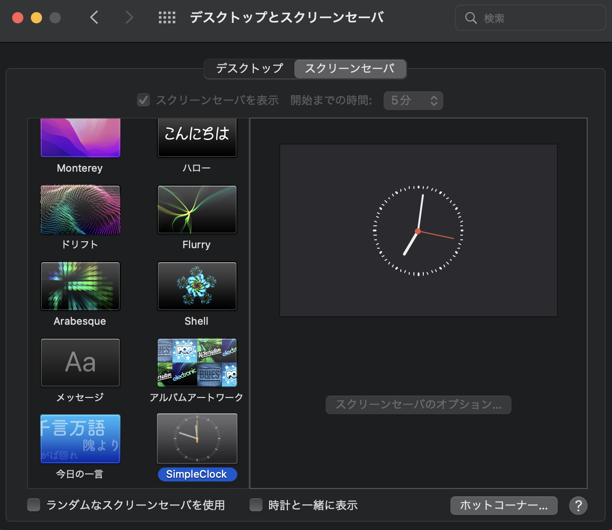
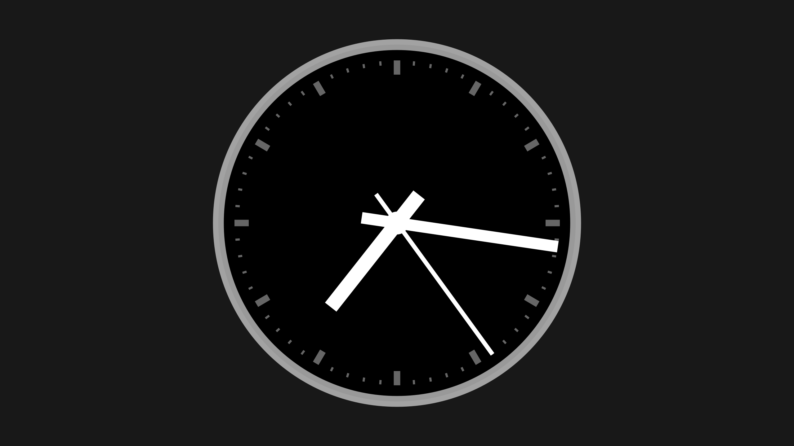

Macが提供するデフォルトのスクリーンセーバはどれも動きが激しく、シンプルな時計を表示してほしい私としてはとても不満に思っていました。

最近見つけた **[Simple Clock Screensaver](https://github.com/Wandmalfarbe/Simple-Clock-Screensaver)** を利用すると以下のようなイケてる時計を表示することができます。



## Simple Clock Screensaver とは

https://github.com/Wandmalfarbe/Simple-Clock-Screensaver

Simple Clock Screensaver は Pascal Wagler 氏が個人で開発しているMacOS向けのスクリーンセーバです。Swiftで書かれており、利用する場合はXcodeを利用してビルドする必要があります。

2022/06/18時点で104のスターを獲得しています。メンテナンスは3年前から行われていませんが、最新のMacOSである Monterey での動作確認ができています。

## 利用方法
このスクリーンセーバはXcodeでビルドした後にPCに設定します

### Xcodeでのビルド方法
GitHubからリポジトリをクローンして、`SimpleClock -> SimpleClock.scodeproj` をXcodeで呼び出します。

Xcodeのメニューから `Product -> Archive` を選択し Archives が開きます。


Archives にて `Distribute Content` を選択すると配布方法を聞かれます。



`Built Products` を選択して保存先を任意の場所にすれば準備完了です。

以下のような階層でファイルが保存されます。

```bash
.
└── SimpleClock
    └── Products
        └── Users
            └── username
                └── Library
                    └── Screen Savers
                        └── SimpleClock.saver
```

Macの設定必要なのは `SimpleClock.saver` というファイルです。

### PCへの設定方法

`SimpleClock.saver` というファイルをダブルクリックしてPCの環境設定より作成したスクリーンセーバを選択すると設定完了です。



## スキンの変更方法

Xcodeで SimpleClock.swift を開きます。スキンの設定は skin 変数にクラスのインスタンスを渡すことで設定していることが確認できます。好みのスキンのコメントアウトを解除することでスキンを変更することができます。デフォルトでは `BraunBN0032Dark` というスキンが設定されています。

```swift
//skin = SwissRailwayClockDark()
//skin = SwissRailwayClockLight()
//skin = TimeSaverClock()
//skin = AscotClock()
skin = BraunBN0032Dark()
//skin = KundoQuartzRepetitionWestGermanyWecker()

//skin = SeikoStandardKX308K()
//skin = SeikoStandardKX308KDark()

//skin = SeikoStandardKX308W()
//skin = SeikoStandardKX308WDark()

//skin = FiveOClock()
```

それぞれのスキンは以下のデザインです。

| class name                               | skin image                                                         |
| ---------------------------------------- | ------------------------------------------------------------------ |
| SwissRailwayClockDark()                  |                   |
| SwissRailwayClockLight()                 |                  |
| TimeSaverClock()                         |                          |
| AscotClock()                             |                              |
| BraunBN0032Dark()                        |                         |
| KundoQuartzRepetitionWestGermanyWecker() |  |
| SeikoStandardKX308K()                    |                     |
| SeikoStandardKX308KDark()                |                 |
| SeikoStandardKX308W()                    |                     |
| SeikoStandardKX308WDark()                |                 |
| FiveOClock()                             |                              |

※ スキンは自作することも可能です。

## 最後に

とても良いスクリーンセーバなのにメンテナンスされていないのがとても残念です。近々プルリクエスト出してみるつもりです。

Simple Clock Screensaver の紹介でした。
