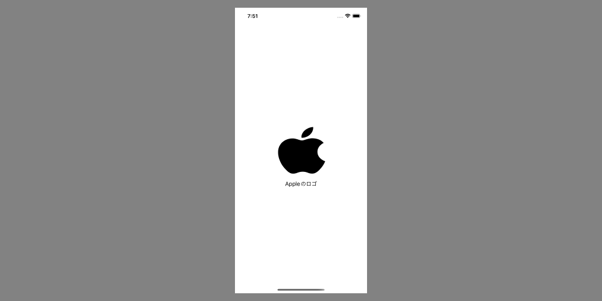
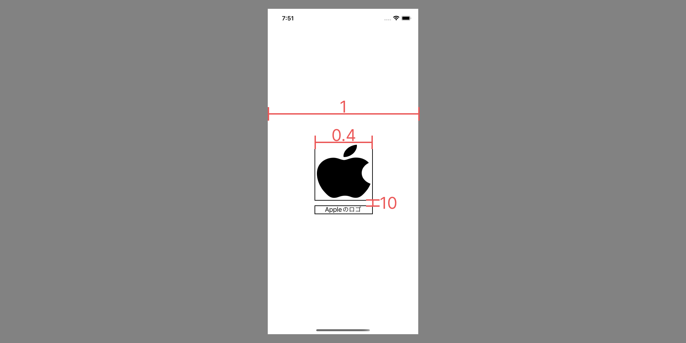

コードだけでUIKitのAutoLayoutを適用する方法について説明します。StoryBoardは一切利用せず、UIImageView, UILabelを画面に表示します。



なお、iOS歴はまだ2ヶ月なので間違っている部分などあれば記事に [Issue](https://github.com/psbss/blog/issues) を立ててください 🙏

---

以下の開発環境を前提に説明します。

```plaintext
- xcode: 13.3.1
- swift: 5.6
- iOS: 15.4
```

StoryBoardを利用しないプロジェクトのテンプレートをGitHubにて公開しています。このテンプレートを利用した状態から説明します。

https://github.com/psbss/swift-uikit-no-storyboard-template

## UIImageView, UILabel を用意する

- ポイント
  - lazy var
  - translatesAutoresizingMaskIntoConstraints

```swift:title=MainViewController.swift
private lazy var iconImageView: UIImageView = {
    let image = UIImageView()
    image.image = UIImage(systemName: "applelogo")
    image.tintColor = .black
    image.translatesAutoresizingMaskIntoConstraints = false
    return image
}()

private lazy var descriptionLabel: UILabel = {
    let label = UILabel()
    label.text = "Appleのロゴ"
    label.textAlignment = .center
    label.translatesAutoresizingMaskIntoConstraints = false
    return label
}()
```

ViewController でUI要素を定義する際は `lazy var` で定義します。  
let で定義してしまうと初期化コストによって画面表示が遅くなるリスクがあるためです。viewDidLoad() 時に呼び出すUI要素はなるべく `lazy var` で遅延評価させます。

コードでAutoLayoutを利用する場合は、 `translatesAutoresizingMaskIntoConstraints` を `false` に指定する必要があります。表示する際に画面がクラッシュ・何も表示されない場合は大抵これを書き忘れています。

<details>
<summary>失敗した際のエラーログ例</summary>

```plaintext
Make a symbolic breakpoint at UIViewAlertForUnsatisfiableConstraints to catch this in the debugger.
The methods in the UIConstraintBasedLayoutDebugging category on UIView listed in <UIKitCore/UIView.h> may also be helpful.
2022-06-05 20:13:23.494340+0900 app-playground[68491:21157936] [LayoutConstraints] Unable to simultaneously satisfy constraints.
	Probably at least one of the constraints in the following list is one you don't want. 
	Try this: 
		(1) look at each constraint and try to figure out which you don't expect; 
		(2) find the code that added the unwanted constraint or constraints and fix it. 
	(Note: If you're seeing NSAutoresizingMaskLayoutConstraints that you don't understand, refer to the documentation for the UIView property translatesAutoresizingMaskIntoConstraints) 
(
    "<NSAutoresizingMaskLayoutConstraint:0x600003e52620 h=--& v=--& UIImageView:0x12fe07580.minY == - 0.333333   (active, names: '|':UIView:0x12fe07010 )>",
    "<NSAutoresizingMaskLayoutConstraint:0x600003e522b0 h=--& v=--& UIImageView:0x12fe07580.height == 1.66667   (active)>",
    "<NSLayoutConstraint:0x600003e46120 UIImageView:0x12fe07580.centerY == UIView:0x12fe07010.centerY   (active)>",
    "<NSLayoutConstraint:0x600003e51e50 'UIView-Encapsulated-Layout-Height' UIView:0x12fe07010.height == 844   (active)>"
)

Will attempt to recover by breaking constraint 
<NSLayoutConstraint:0x600003e46120 UIImageView:0x12fe07580.centerY == UIView:0x12fe07010.centerY   (active)>

Make a symbolic breakpoint at UIViewAlertForUnsatisfiableConstraints to catch this in the debugger.
The methods in the UIConstraintBasedLayoutDebugging category on UIView listed in <UIKitCore/UIView.h> may also be helpful.
```
</details>

## MainViewController に UIImageView と UILabel を表示する
実際に上記で定義した UIImageView と UILabel を表示します。表示する際は以下のデザインの制約を適用します。



まずは画面上に作成したUI要素を”載せます”。

載せる方法は `viewDidLoad` 時に self.view に対して `addSubView()` するだけです。

```swift:title=MainViewController.swift
override func viewDidLoad() {
    super.viewDidLoad()
    view.backgroundColor = .white

    self.view.addSubview(iconImageView)
    self.view.addSubview(descriptionLabel)
}
```

次に制約をつけていきます。制約はそれぞれUIコンポーネントに対して指定しきます。個人的に以下の順で付けるようにしています。

1. width, height
2. (中央配置の場合) center の指定
3. top, bottom, left, right などの指定

AutoLayoutの付け方については[この記事](https://zenn.dev/mikomokaru_jpn/articles/45a66d84d0acfc)が分かりやすく解説されています。

---

```swift:title=MainViewController.swift
override func viewDidLoad() {
    super.viewDidLoad()
    view.backgroundColor = .white

    self.view.addSubview(iconImageView)
    self.view.addSubview(descriptionLabel)

    NSLayoutConstraint.activate([
        iconImageView.widthAnchor.constraint(equalTo: self.view.widthAnchor, multiplier: 0.4),
        iconImageView.heightAnchor.constraint(equalTo: iconImageView.widthAnchor),
        iconImageView.centerXAnchor.constraint(equalTo: self.view.centerXAnchor),
        iconImageView.centerYAnchor.constraint(equalTo: self.view.centerYAnchor),

        descriptionLabel.widthAnchor.constraint(equalTo: self.view.widthAnchor, multiplier: 0.4),
        descriptionLabel.centerXAnchor.constraint(equalTo: self.view.centerXAnchor),
        descriptionLabel.topAnchor.constraint(equalTo: iconImageView.bottomAnchor, constant: 10),
    ])
}
```

`iconImageView` は画面幅を1としたときに 0.4 なので multiplier で 0.4 を指定します。また、`descriptionLabel` は iconImageView から 10px下に配置するので constant で10を指定しました。

このままでもいいですが、コードが煩雑なので multiplier や constant の数値は変数化ししたほうがメンテしやすいですね。

## 完成した画面と全体のコード


```swift:title=MainViewController.swift
final class MainViewController: UIViewController {
    // 変数名が雑なのはご愛嬌ということで 🙏
    let multiplier: CGFloat = 0.4
    let labelMargin: CGFloat = 10.0

    private lazy var iconImageView: UIImageView = {
        let image = UIImageView()
        image.image = UIImage(systemName: "applelogo")
        image.tintColor = .black
        image.translatesAutoresizingMaskIntoConstraints = false
        return image
    }()

    private lazy var descriptionLabel: UILabel = {
        let label = UILabel()
        label.text = "Appleのロゴ"
        label.textAlignment = .center
        label.translatesAutoresizingMaskIntoConstraints = false
        return label
    }()

    override func viewDidLoad() {
        super.viewDidLoad()
        view.backgroundColor = .white

        self.view.addSubview(iconImageView)
        self.view.addSubview(descriptionLabel)

        NSLayoutConstraint.activate([
            iconImageView.widthAnchor.constraint(equalTo: self.view.widthAnchor, multiplier: multiplier),
            iconImageView.heightAnchor.constraint(equalTo: iconImageView.widthAnchor),
            iconImageView.centerXAnchor.constraint(equalTo: self.view.centerXAnchor),
            iconImageView.centerYAnchor.constraint(equalTo: self.view.centerYAnchor),

            descriptionLabel.widthAnchor.constraint(equalTo: self.view.widthAnchor, multiplier: multiplier),
            descriptionLabel.centerXAnchor.constraint(equalTo: self.view.centerXAnchor),
            descriptionLabel.topAnchor.constraint(equalTo: iconImageView.bottomAnchor, constant: labelMargin),
        ])
    }
}
```
