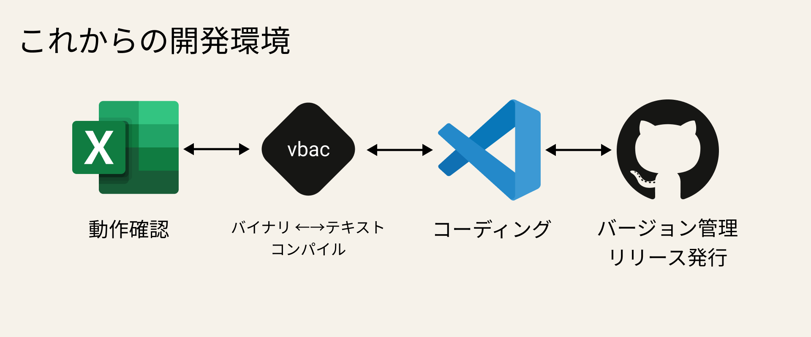
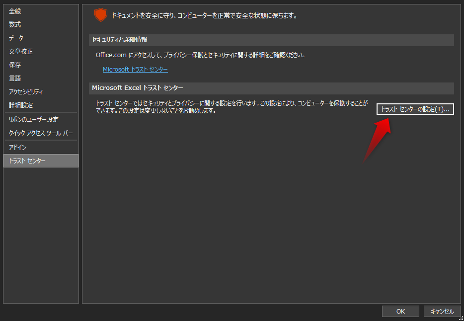
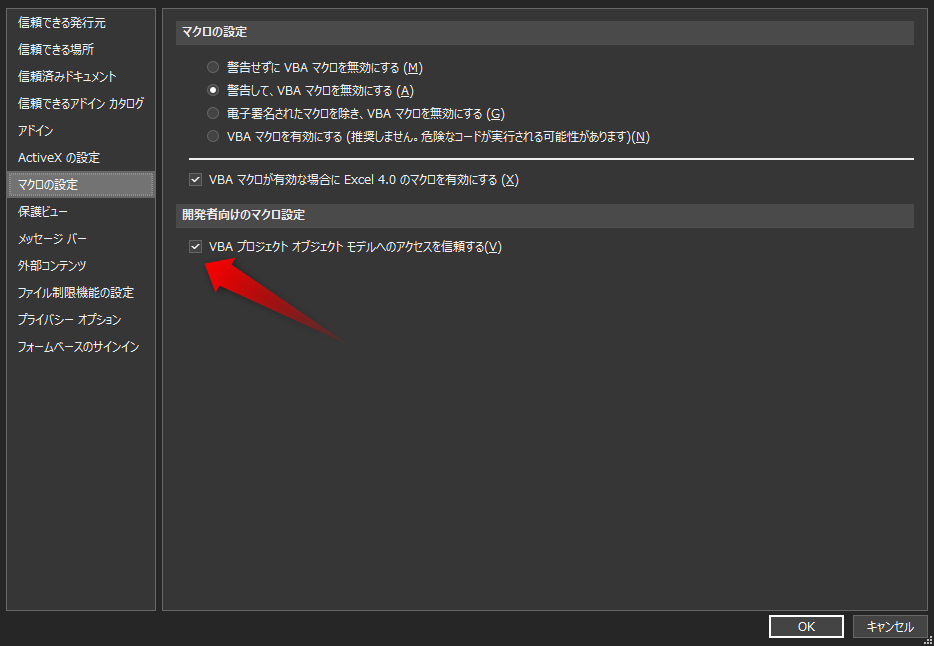

> Qiita Advent Calender 2021 「[初めてのアドベントカレンダー](https://qiita.com/advent-calendar/2021/first-try)」の9日目の記事です。

大学の研究で開発しているシステムに必要なデータを事前処理する必要があり、実行環境の制約で Excel VBA を利用する必要がありました。

小学生以来の約10年ぶりに開発することになりましたが、普段は VSCode 等のエディタや Git 等のバージョン管理ツールを利用しているため、Excel VBA の開発環境が非常にストレスの貯まるものでした。2021年のモダンな環境を構築し、なおかつチーム開発できる環境を作ったというのが今回の主題です。


- この記事を読むと構築・理解できること
    - VBA開発のツラミ
    - VBA開発でVSCodeを利用する方法
    - VBA開発でGitを利用したバージョン管理する方法
    - VBA開発でGitHubを用いたチーム開発環境を構築する方法

最終的に以下のような構成になります。



サンプルリポジトリはこちら 👇<br>
https://github.com/psbss/vba-sample

おことわり 🙇
- Windows 環境での開発を想定しています。
- 触った期間は1ヶ月程度なので、「それ、VBAでもできるよ」みたいなツッコミポイントがある可能性があります。そういった場合は教えていただけると幸いです（GitHubに記事のソースコードがあるのでPR送って頂くか、Issueを立ててください）

## VBA開発のツラミ
VBAの開発のツラミは上げればきりがないほど多々ありますが、致命的なのはGitで差分が取れないのでチーム開発ができないことです。

### 言語がツラい
VBAは「なんちゃってオブジェクト指向」な言語なので、みんな大好きクラス定義からの継承とかができません。言語が◯ソ、これはどうしようもない。

### チーム開発ができない
普段ソフトウェアを開発する際はチームで開発することが多いと思いますが、デフォルトの環境ではExcel VBAをGitで管理することができません。Excelファイルはバイナリファイルのため、Gitでバージョン管理してもファイル全体が記録されてしまい、変更したソースコードを行単位で確認することができません。

### Excel内蔵のVBAエディタ（VBE）がレガシーすぎる
ExcelにはVBAを開発するためのエディタ（Visual Basic Editor）が備え付けられていますが、VSCodeの便利さを知ってしまった人類からすると非常にレガシーで、ストレスがたまります。例えば以下のことができません。

- ファイルに行数を表示できない
- 複数行のコメントアウトをショートカットで付けれない
- インテリセンス（コード補完）が出たり、出なかったりする
- コードの一括リフォーマットができない
- 統合検索機能が無い

最近のエディタであればできそうなことがVBEだとできません。

### ユニットテストが難しい
ユニットテストの実装・動作が難しいです。Djangoのようにテスト用のクラスが定義されていて、継承してテストケース書けばユニットテストできるみたいな世界ではありません。

それっぽい[記事](https://qiita.com/hiki_neet_p/items/860a16f44ad835624ce6)はあるので、ある程度VBAに慣れたエンジニアなら実現はできそうです。

### Linterが存在しない
GitHubやStackOrverflowを漁りましたが、どうやらLintツールが存在しないようです。元々がバイナリファイルなのでテキストファイルにした上でLintしたい人が居ないのかもしれません。Lintの作り方が分からないので知っている方いれば教えていただきたいです。

## VBA開発でVSCodeを利用する方法
ここから本格的に開発環境を構築していきます。

以下のような構造のディレクトリを作成してください。

```bash
vba-sample
├── bin/
└── src/
```

### Excelのセキュリティ設定を変更して開発者モードにする
Excel設定オプション → トラストセンター → トラストセンターの設定 を開く



マクロの設定 → 開発者向けのマクロ設定の「VBAプロジェクトオブジェクトモデルへのアクセスを信頼する」にチェックをつける。



### Excel VBAのバイナリファイルをテキストファイルに変換する
まずはVBAのファイルをテキストファイルに変換します。変換には[vbac](https://github.com/vbaidiot/Ariawase)というOSSを利用します。

[https://github.com/vbaidiot/Ariawase](https://github.com/vbaidiot/Ariawase)

リポジトリには色々なファイルが存在しますが、必要なのは `vbac.wsf` のみです。以下のように設置します。

```bash
vba-sample
├── bin/
├── src/
└── vbac.wsf  //追加
```

`bin/` ディレクトリ以下に変換対象のExcelVBAファイル（`.xlsm`）を設置します。

```bash
vba-sample
├── bin/
│   └── sample.xlsm  //追加
├── src/
└── vbac.wsf
```

Windows PowerShell を開いて変換用コマンドを実行します。

```shell
$ cscript vbac.wsf decombine
```

すると `src/` 以下にテキストファイルが作成されます。

```bash
vba-sample
├── bin/
│   └── sample.xlsm
├── src/
│   └── sample.xlsm/  //追加
│       └── Module1.bas  //追加
└── vbac.wsf
```

### VSCode で開発する
`vba-sample` をVSCodeで開いて開発します。

日本語を含むVBAファイルの場合は文字化けする可能性があるので文字コードを `Shift JIS` 、改行コードを `CRLF` に変更します。

```bash
vba-sample
├── .vscode/  //追加
│   └── settings.json  //追加
├── bin/
│   └── sample.xlsm
├── src/
│   └── sample.xlsm/
│       └── Module1.bas
└── vbac.wsf
```

```json:title=settings.json
{
  "[markdown]": {
    "editor.wordWrap": "on",
    "editor.quickSuggestions": false,
    "files.encoding": "utf8",
  },
  "files.encoding": "shiftjis",
  "files.associations": {
    "*.bas": "vb",
    "*.cls": "vb",
    "*.dcm": "vb",
    "*.frm": "vb",
  }
}
```

VSCode向けの便利な拡張機能もあるので導入をおすすめします。

https://marketplace.visualstudio.com/items?itemName=local-smart.excel-live-server

### VBAのコードをバイナリに変換して動作確認する
VSCodeで開発したあとにExcelでの動作確認を行う場合はバイナリファイルに戻す必要があります。

Windows PowerShell を開いて変換用コマンドを実行すると、`bin/` ディレクトリ以下に設置したバイナリファイルが更新されます。

```shell
$ cscript vbac.wsf combine
```

## VBA開発でGitを利用したバージョン管理する方法
普段通りに `git init` すればいいのですが、文字コードの制約があるので `.gitattributes` を追加します。

```bash
vba-sample
├── .vscode/
│   └── settings.json
├── bin/
│   └── sample.xlsm
├── src/
│   └── sample.xlsm/
│       └── Module1.bas
├── .gitattributes  //追加
└── vbac.wsf
```

```plaintext:title=.gitattributes
# Auto detect text files and perform LF normalization
* text=auto

*.bas       text    eol=crlf
*.cls       text    eol=crlf
*.frm       text    eol=crlf
*.frx       binary  eol=crlf
*.dcm       text    eol=crlf
*.vbaproj   text    eol=crlf

*.wsf       text    eol=crlf
*.bat       text    eol=crlf

*.cls linguist-language=VBA
*.dcm linguist-language=VBA
*.vbaproj linguist-language=INI

# file encording
*.bas working-tree-encoding=sjis
*.dcm working-tree-encoding=sjis
*.frm working-tree-encoding=sjis

*.bas diff=sjis
*.dcm diff=sjis
*.frm diff=sjis

*.bas encoding=sjis
*.dcm encoding=sjis
*.frm encoding=sjis
```

## VBA開発でGitHubを用いたチーム開発環境を構築する方法
コンフリクト対策のためベース用のExcelファイルを追加します。

```bash
vba-sample
├── .vscode/
│   └── settings.json
├── bin/
│   ├── base_xls  //追加
│   │   └── sample.xlsm  //追加
│   └── sample.xlsm
├── src/
│   └── sample.xlsm/
│       └── Module1.bas
├── .gitattributes
├── .gitignore  //追加
└── vbac.wsf
```

```plaintext:title=.gitignore
*.tmp
*.xls*
!bin/base_xls/*.xls*
!src/*
```

ExcelVBAのバイナリファイルから変換する際のコマンド失敗すると変更が吹き飛ぶことがあるのでバッチファイルを作ります。バッチファイルも文字コードが `Shift JIS` 、改行コードが `CRLF` で作らないと実行できないので気をつけてください。

```bash
vba-sample
├── .vscode/
│   └── settings.json
├── bin/
│   ├── base_xls
│   │   └── sample.xlsm
│   └── sample.xlsm
├── src/
│   └── sample.xlsm/
│       └── Module1.bas
├── .gitattributes
├── .gitignore
├── CONVERT.bat  //追加
├── EXPORT.bat  //追加
└── vbac.wsf
```

```batch:title=CONVERT.bat
@echo off

:: --- 変数の宣言 ---
set base_file="sample.xlsm"

:: --- バッチファイル内容 ---

:: 実行時引数が -y の場合 :bool_exe_yes にスキップ
if {%1} == {-y} (goto :bool_exe_yes)

set /p bool_exe="VBAコードを結合しますか? (Y=Yes / N=NO)"
:: /i は大文字と小文字を制限せずに比較する
if /i  == {y} (goto :bool_exe_yes)
if /i  == {yes} (goto :bool_exe_yes)

:: "no" の場合処理終了
echo 処理を終了します
exit

:bool_exe_yes
:copy_file
    echo ベースファイルからコピーしています
    copy .\bin\base_xls\%base_file% .\bin\%base_file%

    if %ERRORLEVEL% equ 0 (
        echo コピーが成功しました
        echo コードの結合を開始します
        echo:

        :: vbacの実行
        cscript vbac.wsf combine
        echo コードの結合が終了しました
        echo:
    ) else (
        echo:
        echo 指定されたファイルが見つからないか、コピー先のExcelファイルが開いています。
        echo エンターキーを押すと再度実行します。
        pause
        goto :copy_file
    )
exit
```

```batch:title=EXPORT.bat
@echo off

:: --- バッチファイル内容 ---

:: 実行時引数が -y の場合 :bool_exe_yes にスキップ
if {%1} == {-y} (goto :bool_exe_yes)

set /p selected="VBAコードを分離しますか? (Y=Yes / N=NO)"
:: /i は大文字と小文字を制限せずに比較する
if /i  == {y} (goto :bool_exe_yes)
if /i  == {yes} (goto :bool_exe_yes)

:: "no" の場合処理終了
echo 処理を終了します
exit

:bool_exe_yes
    pushd %0\..
    cscript vbac.wsf decombine
    echo コードの分離が終了しました
exit
```

以上のファイルを作成することで PowerShell でのエクスポート・コンバートを以下のコマンドで実行することができます。

```shell
# エクスポート（バイナリファイルからテキストファイルへの変換）
$ .\CONVERT.bat -y

# コンバート（テキストファイルからバイナリファイルへの変換）
$ .\EXPORT.bat -y
```

以上のように構築することで、チームでもコンフリクトせずに開発することが可能です。


## 補足
1. [Rubberduck](https://github.com/rubberduck-vba/Rubberduck) というExcel VBEの拡張機能を利用すれば便利になりますが、本題からそれるため取り上げていません。
2. サンプルリポジトリを公開しています（[https://github.com/psbss/vba-sample](https://github.com/psbss/vba-sample)）

## 参考
- [VBAにはユニットテストやリファクタリング機能がない・・・そんなふうに考えていた時期が俺にもありました](https://qiita.com/mima_ita/items/3629006163d0a7fa6e55)
- [vbacでエクセルVBAのソースコードをGitバージョン管理する方法](https://tonari-it.com/vba-vbac-git/)
