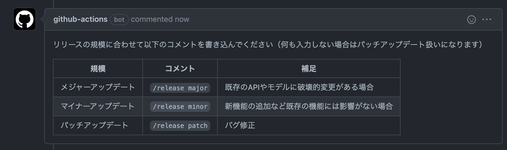
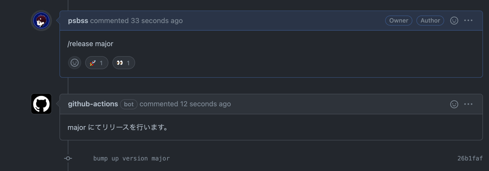

思い立ったら即行動、ということで週末ハッカソン開催しました〜🎉

## 成果物

PullRequestのコメントでリリース予約を行えるようにするGitHub Actionsを構築しました。

https://github.com/psbss/pr-comment-release

### ワークフローの説明

PRを作成するとActions Botがコメントでリリース制御のコマンドについて説明を投げてくれます。

`/release major` のようにコマンドをコメントするとBotが対応した制御用空コミットをプッシュしてくれます。

マージすると、リリース用のActionsが走り、制御用コミットを判別してセマンティックバージョニングに基づき新しいリリースを発行してくれます。

## モチベーション

大学の研究でGitHubを複数人利用していますが、バージョンを上げるべきタイミングで上げ忘れてしまうことが多々ありました。探してみると[GitHubActionsを利用してコメントしたコマンドを実行する](https://buildersbox.corp-sansan.com/entry/2021/02/05/110000)ことができるとのことだったので、拡張してリリースの制御を行えるようにしてみよう。というのが今回のモチベーションです。

## 学び

GitHub Actions のセキュリティを意識したり、GitHubが提供しているAPIを叩いてみたり、高速化のためにデバッグしたりするなど、今までのActions構築ではあまり考慮しなかった部分を考えることができたハッカソンでした。

Linuxの仮想サーバに乗っているので基本的に何でも動かすことができますが、フリープランだと2000分/月プロプランでも3000分/月と制限があることに加え、少人数開発で素早くマージしたい場合は動作させるコスト（時間・金額）に注目して構築する必要があるなと考えました。

## 今後の目標

今回のワークフローはあくまで、コメントしたコマンドによって自動でリリース判別用のコミットが生成される、という構築だったため、もう少し改良してコメントしたコマンドをマージ後に判別してリリースの制御を行うように変更したいと考えています。

## 参考
- [GitHub Docs](https://docs.github.com/ja/actions)
- [SanSan Builders Blog - 【R&D DevOps通信】GitHub Actions: コメント駆動のワークフローを作る](https://buildersbox.corp-sansan.com/entry/2021/02/05/110000)
- [入門 GitHub Actions](https://tech.medpeer.co.jp/entry/2021/06/24/100000)
