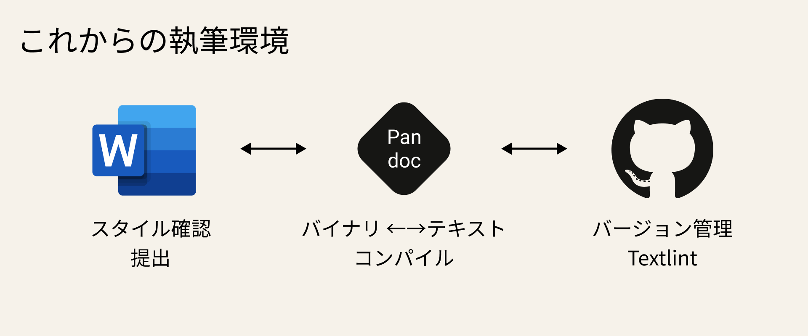

> Qiita Advent Calender 2021 「[初めてのアドベントカレンダー](https://qiita.com/advent-calendar/2021/first-try)」の17日目の記事です。

大学生活も残り3ヶ月を切り、論文執筆が忙しい上ちょ（[@psnzbss](https://twitter.com/psnzbss)）です。

理系の学生の場合、論文はTex（LaTex）を利用して執筆する人が多い気がしますが、私の大学は ~~なんちゃって~~ 情報学科なので、Microsoft Office の Wordを利用して論文を執筆します。

Texはテキストファイルなので、Textlint等の静的構文解析・チェックを利用することができますが、Wordファイル（.docx）はOpen XMLというフォーマットのファイル（実質バイナリファイル）のため、そのままの形式ではTextLintをすることができません。


この記事ではWordファイルを自動でMarkdown記法に変換することで差分を可視化するとともに、GitHub Actions で Textlint を実行することで文法や文末チェックを自動処理する **エンジニア向け** の論文執筆環境を作ります。



※ 余談ですが、Texは教授に拒否されました()

---

- サンプルリポジトリを公開しています。
    - https://github.com/psbss/word-textlint-sample
- この記事で利用する技術等々
    - Word（.docx）
    - Pandoc
    - Markdown
    - TextLint
    - Git
    - GitHub
    - GitHub Actions
- この記事を読むとできるようになること
    - WordファイルからMarkdownファイルへの変換
    - GitHubActions上でTextLintを走らせる方法

---

## PandocでWordファイルをMarkdownファイルに変換する
Wordファイル（.doc/.docx）はXMLベースのファイルのため、そのままではGitで差分管理することや、Textlintを利用することはできません。Wordファイルをマークダウン形式のファイルに変換するために利用するのが、[Pandoc](https://pandoc-doc-ja.readthedocs.io/ja/latest/users-guide.html#synopsis)です。

https://pandoc-doc-ja.readthedocs.io/ja/latest/users-guide.html#synopsis

Pandocは現在でも非常に活発に開発されているマークアップ・ワープロ形式ファイルの相互変換ライブラリです。

インストール方法が少し難しいので、より詳細に書いてある [[Zettlr のドキュメント]](https://docs.zettlr.com/ja/installing-pandoc/) を参照してください。ここではMacOS向けのインストール方法のみ記載します。

```bash
# MacにてHomebrewを利用している場合以下でインストールできる。
$ brew install pandoc
```

`test.docx` というWordファイルを作成して同じ階層でPandocを実行します（ファイル形式など必要最低限の指定をしています）。

```bash
$ pandoc test.docx -f docx -t gfm -o test.md

# -f : 変換元ファイルのファイル形式
# -t : 変換先ファイルのファイル形式（gfmはGitHubにて利用されているマークダウンの形式）
# -o : 変換後の保存ファイル名
```

実行すると同じ階層に `test.md` というファイルが生成されます。

```markdown:title=test.md
# MS Wordで書いた文章をPandocでマークダウンに変換する

Wordで書いた文章をPandocというライブラリを利用してマークダウン形式のファイルに変換します。この文章はブログのサンプルとして書いています。詳しくは[この記事](https://blog.ue-y.me/word-git-textlint/)を読んでください。

## はじめに

こんにちは。論文執筆中の上ちょです。
```

Gitで差分を見やすくするためにオプションを追加して実行します。

```bash
$ pandoc test.docx -f docx -t gfm -o test.md --wrap=none --reference-links

# --wrap : 折返しの設定（規定は72文字で折り返しするがNoneで無効化）
# --reference-links : リンクを最下部にまとめる
```
```markdown:title=test.md
# MS Wordで書いた文章をPandocでマークダウンに変換する

Wordで書いた文章をPandocというライブラリを利用してマークダウン形式のファイルに変換します。この文章はブログのサンプルとして書いています。詳しくは[この記事][]を読んでください。

## はじめに

こんにちは。論文執筆中の上ちょです。

  [この記事]: https://blog.ue-y.me/word-git-textlint/
```

無事にWordファイルからマークダウン形式のテキストファイルに変換することができました。Gitに乗せれば強力な差分管理が行えます。

### スクリプトを作ってGit Pushまで自動化する。
毎回、長々としたコマンドを入力するのは面倒なので、スクリプトファイルを作成します（Mac / WSL向けシェルスクリプト）

```bash:title=docx2md.sh
#!/bin/bash

# define variable
date=`date '+%Y%m%d'`

from_filename="test.docx"
from_exe="docx"
to_filename="test.md"
to_exe="gfm"

options="--wrap=none --reference-links"
current_branch=`git rev-parse --abbrev-ref HEAD`


# command
pandoc -s ${from_filename} -f ${from_exe} -t ${to_exe} ${options} -o ${to_filename}


gitfunc() {
  git add -A
  git commit -m "Auto commit by docx2md"
  git push --set-upstream origin ${currentbranch}
}

if [[ $# -gt 0 ]]; then
  echo "catch commandline args"
  if [[ $1 == "push" ]]; then
    echo "git add / commit / push"
    gitfunc
  fi
fi
```

```bash
# permission denied: ./docx2md.sh と言われた場合は以下を実行
chmod 700 ./docx2md.sh

# 以下のコマンドでGitコミット・プッシュができる
./docx2md.sh push
```

## GitHub Actions で Textlint を実行する
論文の場合は文末が「だ・である調」になっていることや、点丸が「，．」に統一されているなどの条件があります。[Textlint](https://github.com/textlint/textlint)のルールを利用することで、文末のチェックだけでなく、日本語文章としておかしい文体なども校正してくれるなど、かなり強力にチェックしてくれます。

### Textlint の使い方
Textlint 単体では特に何もできないので、有志で作られているルールやプリセットを利用します。

- ルール（Rule）
    - `、。` や `ら抜き言葉` をチェックする単体の設定ファイル
- プリセット（Preset）
    - 複数のルールをまとめたもの。目的に対して必要なルールが全部入りになったもの

プリセットの利用は便利ですが、内部で動いてるルールが見えなくなるため、後から追加したルールが競合することがあります。個人的にカスタマイズしたルールを利用したいため個別にルールを追加していきます。

- textlint
    - textlintの本体
- textlint-rule-ja-hiragana-fukushi
    - 漢字よりもひらがなで表記したほうが読みやすい副詞を指摘する
- textlint-rule-ja-hiragana-hojodoushi
    - 漢字よりもひらがなで表記したほうが読みやすい補助動詞を指摘する
- textlint-rule-ja-hiragana-keishikimeishi
    - 漢字よりもひらがなで表記したほうが読みやすい形式名詞を指摘する
- textlint-rule-ja-no-weak-phrase
    - 弱い日本語表現の利用を禁止する
    - 「～かもしれない」「～だと思う」など論文に適さない表現を禁止
- textlint-rule-ja-unnatural-alphabet
    - 不自然なアルファベットを検知する
- textlint-rule-no-double-negative-ja
    - 二重否定の禁止する
- textlint-rule-no-dropping-the-ra
    - ら抜き言葉を検知する
- textlint-rule-no-mix-dearu-desumasu
    - 敬体(ですます調)と常体(である調)の混在をチェックする
- textlint-rule-no-mixed-zenkaku-and-hankaku-alphabet
    - 全角と半角アルファベットを混在をチェックする
- textlint-rule-prefer-tari-tari
    - 例示・並列表現の「～たり、（～たり）する」をチェックする
- @textlint-ja/textlint-rule-no-synonyms
    - 同義語の表記ゆれをチェックする

```bash
# 上記のライブラリをインストールする
$ npm install -D textlint textlint-rule-ja-hiragana-fukushi textlint-rule-ja-hiragana-hojodoushi textlint-rule-ja-hiragana-keishikimeishi textlint-rule-ja-no-weak-phrase textlint-rule-ja-unnatural-alphabet textlint-rule-no-double-negative-ja textlint-rule-no-dropping-the-ra textlint-rule-no-mix-dearu-desumasu textlint-rule-no-mixed-zenkaku-and-hankaku-alphabet textlint-rule-prefer-tari-tari @textlint-ja/textlint-rule-no-synonyms
```

次に設定ファイルを追加します。

```bash
word-textlint-sample
├── .gitignore
├── .textlintrc  # 追加
├── docx2md.sh
├── package-lock.json
├── package.json
├── test.docx
└── test.md
```

```text:title=.textlintrc
{
  "rules": {
    "@textlint-ja/no-synonyms": true,
    "ja-hiragana-fukushi": true,
    "ja-hiragana-hojodoushi": true,
    "ja-hiragana-keishikimeishi": true,
    "ja-no-weak-phrase": true,
    "ja-unnatural-alphabet": true,
    "no-double-negative-ja": true,
    "no-dropping-the-ra": true,
    "no-mix-dearu-desumasu": true,
    "no-mixed-zenkaku-and-hankaku-alphabet": {
      "prefer": "半角"
    },
    "prefer-tari-tari": true
  }
}
```

以上の設定ファイルを追加することで textlint を実行できます。

```bash
$ npx textlint *.md
```

### GitHub Actions を利用してPR時に Textlint を実行する
GitHubActions（GHA）を利用してプルリクエスト（PR）作成時に自動で Textlint を実行するようにします。

```bash
word-textlint-sample
├── .gitignore
├── .textlintrc
├── docx2md.sh
├── package-lock.json
├── package.json
├── test.docx
├── test.md
└── .github  # 追加
    └── workflows  # 追加
        └── lint.yml  # 追加
```

```yaml:title=lint.yml
name: Textlint workflow

on:
  pull_request:
    types: [opened, synchronize, reopened]

jobs:
  textlint:
    name: textlint
    runs-on: ubuntu-latest

    steps:
      - uses: actions/checkout@v2
      - uses: actions/setup-node@v2
        with:
          node-version: '16'
          cache: 'npm'
      - name: npm install
        run: npm ci
      - name: test
        run: npx textlint *.md
```

## 個人的な使い方

執筆する際は `draft/日付` というブランチを切り、執筆を行います。週次で担当教員に提出する必要があるため、提出前に `draft/日付` を `main` ブランチに向けてPRを作り、GHAをクリアすればマージします。GHAのテストで失敗した場合は修正を繰り返します。翌週、新しく `draft/日付` ブランチを切り、執筆繰り返します。

## 補足
本当はMarkdownで執筆して、最後にWord化して提出したかったのですが、教員がレビュー時にもWordでスタイルを揃えて書いてくれとのことだったので、仕方なく以上のような構成になっています。

Wordの良くないところは、スタイル指定がバイナリなんですよね。ヘッダー・フッターの余白等なら Pandoc でも指定してWord化できるんですが、文章の字下げをルーラを利用して行っていたり、フォントを指定していたりするとマークダウンからWordにしても適用されません。なのでWordからマークダウンに直して差分を取ったりしています。

他大学でも似たような条件で論文執筆する人がいるらしいので、今回まとめてみました。参考になれば幸いです。


質問等あればTwitterにて。ではまた～ 🤟
