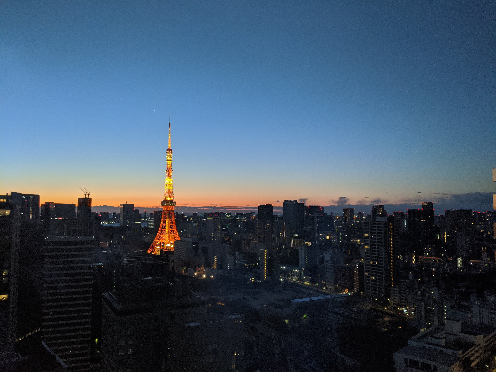
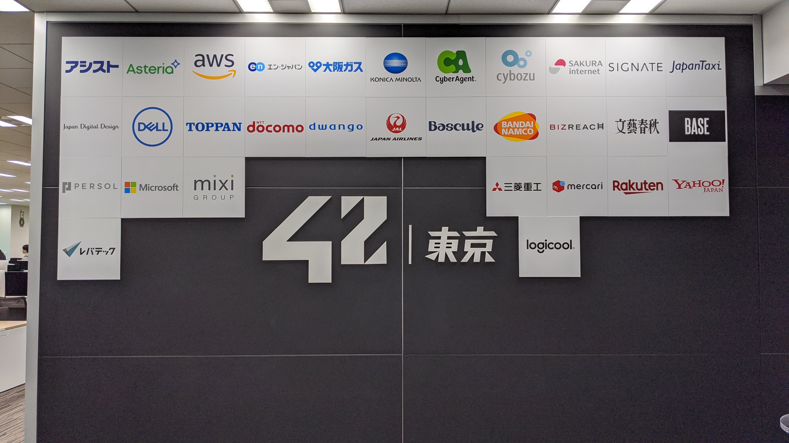

7月の開校と共に入学して3ヶ月が経過しました

本当の意味でのダイバーシティ、カオス、実力主義で最高に楽しかったです。

## 42 との出会い
42Tokyoを知ったのは合同会社DMMが発表したPRTimesの記事でした。

「[教師が付かない完全無料のプログラミングスクール](https://prtimes.jp/main/html/rd/p/000003451.000002581.html)」という少し胡散臭いタイトルと共に公開されたPR記事は、学生エンジニアとして、今ひとつ技術が身につかないジレンマに囚われていた私の好奇心を擽るには十分でした。

「今後、エンジニアと生きていくのであればアルゴリズムはもちろん、変化の早い世界で生きていく力が必要だ。このままでは、ちょっとパソコンを触る時期が早いだけのアドバンテージは価値が無い」そんなことを考えながら、完全無料、教師なし、プログラミングスクールの形を大きく変えるプロジェクトの始まりに心をざわつかせたことを今でも鮮明に覚えています。

## 適性検査
### 一次
一次適性検査はWeb上でロジックパズルを解きました。雪が降りそうな天気の中、こたつにコーヒーという布陣で挑みました。事前のリサーチによるとLv10を超える辺りがボーダーとのことだったので時間を横目に脈早く解いた記憶があります。

無事、一次適性検査の合格通知を受けて安心していると、「二次適性検査の日程」という緊急試練がありました。

すでに1月試験は満員、2月と3月がかろうじて空いている状況だったので3月に応募。しかし数日後、もし二次適性検査をクリアした場合は試験後の学業を休学する必要があることなどを考え、2月への変更を申請しました。この時すでに満員となっており300人待ちの状況でした。

日に日に減っていく人数、12月末に300人の参加キャンセルを経て2月Piscineへの参加が確定しました。（まさかこの時の判断が後の新型コロナウイルスによる適性検査（3月）の中止を回避することになるとは知るはずもなく）

### 二次 - Piscine

Piscine開始2日前に Timee の小川社長と飲む機会がありました。「優秀なエンジニアがいるのであれば欲しい。プロダクトが今後もっと大きくなる。エンジニアは必要不可欠だ」こんな言葉を話していた気がします。

Piscine前日、寝坊は絶対にしたくなかったので六本木のカプセルホテル「Binemu」に宿泊しました。Piscine初日の朝食はグランドタワー1Fのタリーズでコーヒーとサンドイッチを食べた気がします。後ほど知った話ですが、前日にBinemuに止まっていた受験生やタリーズコーヒーでサンドイッチを頼んだ人が結構な人数いたようでした。

1月に試験を受けた学生の情報から、想像以上に難しいと話を伺っていたPiscineだが、そうは言っても実際にプロダクトを作った経験があったので「なんとかなるだろう」と考えていました。残念ながら？予想を裏切られ「めちゃくちゃ難しかった」のは言うまでもないです。

満員電車には乗りたくなったので昼に登校し、夜は終電間際に片道1時間くらい掛けて帰宅する生活をひたすら続けました。

Piscineでは最低限のルールと、とりあえず「やってみてください」と言われます。初めは厳しい生活だと思っていましたが、気がつけばその環境を楽しんでいる自分がいました。

2月後半、新型コロナウイルスが本格的に騒がれ始め、マスクこそしていませんでしたが、手を洗う回数を増やしキーボードやマウスを消毒していた記憶があります。

余談ですが、2月後半に Perfume の東京ドーム公演に行きました。アリーナ席前列ステージ前13列目という最高のポジションでしたが、PiscineのRushというイベントのレビューがあり遅れて入場したのはいい思い出です笑。なお、次の日の公演は中止になりました。

いよいよPiscineも中止になるかと不安でしたが、なんとか終了。Exam終了後にみんなで飲みに行きました。2次会はカラオケ、3次会は居酒屋、4次会はバー、5次会はうどん。6次会？はグランドタワーで入り口のゲートにカードが反応しないことを確認しました。

3月初旬、実家にて合格の連絡を受けました！

## 入学試験（Piscine）が一番重要
Piscineで学んだことは多数ありますが、私が特に重要だったと考えていることの一つに「検索」があります。経験の有無に関係無く、いかにして大量の情報を検索することができるかどうか、たとえ時間が掛かったとしても大量の情報を元に処理する、というスキルを身につけることができたのがPiscineの凄い点でした。

通ったあとには草も生えないほど圧倒的に調べ尽くすことの重要性。気力が尽きるまで検索して惰性でプログラムを書ききる。尽き果てたらトイレ休憩。

この圧倒的な熱中と情報処理能力を教えてくれたのが Piscine でした。

## 最後に
このような恵まれた環境で学習することができたことは本当に嬉しく思います。残念ながら私生活の変化と世界的な環境の変化、学習能力、など複合的な要因により10月初旬にBHとなる予定です。

42での生活は学生資金力乏しい私でも公平に与えられたチャンスであり、背景の異なる「同じ意志を持つ」複数の人と触れ合える最初の機会でした。42で学んだ「検索の力」「本物の熱中」「スケジューリング」「コミュニケーション」すべてが今後のギアを早めてくれると確信しています。
