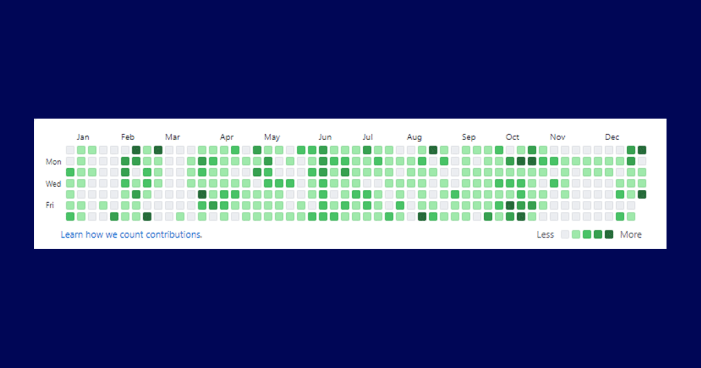

2020年も終わるので反省も兼ねて振り返ります

## ざっくりまとめ
- 新型コロナで大学が休校になり、予定していたカンファレンスも軒並み中止になった
- 42Tokyoの選抜試験 Piscine に参加し、1ヶ月フルコミットした
- ソフトバンク・DMM・メドレーの3社でインターンを経験した
- 計画は大きく崩れたが、結果としてチャンスに全力でベットできる一年になった

## 詳細
今年といえば新型コロナウイルスでした。大学は休校になり、技術系セミナーやカンファレンス、航空券まで手配していた「[Google I/O 2020](https://twitter.com/psnzbss/status/1234989188316946432?s=20)」も中止になりました。

そんなコロナ禍の前、2月には42Tokyoの選抜試験 Piscine に参加しました。今年一番印象に残っているイベントは何と言ってもこれです。圧倒的な熱量と精神をギリギリまで削りながら1ヶ月コミットし続けたあの日々は忘れることができません。

計画が大きく崩れてしまった1年でしたが、結果としてチャンスに全力でベットできる年だったと考えています。

## 今年の目標と達成状況
2020年1月1日に今年の目標を公開しました。

<blockquote class="twitter-tweet">
【2020年の目標】 ・Django製サービスをデプロイ ・アウトプットを増やす(月3更新) ・インターンで攻める ・企業訪問も攻める ・ポートフォリオの更新 ・ビジネス/アイデア戦略を作る ・エンジニア友達増やす ・収入源増やす ・減量と筋トレ
&mdash; 上ちょ / uetyo (@psnzbss) <a href="https://x.com/psnzbss/status/1212072605777182723?ref_src=twsrc%5Etfw">December 31, 2019</a></blockquote> 

### Django製サービスをデプロイ
結果：⭕️

Django製のアプリをデプロイする予定でしたが、ソーシャル的にグレーなサービスになりそうだったので、クローズドですが公開できました。

### アウトプットを増やす（月3更新）
結果：❌

ブログを新しくしたので開発がメインになってしまったことと、就活がかなり忙しかったため更新ができず、結果として14本の公開となりました。来年は倍以上公開したいです。

### インターンで攻める
結果：⭕️

- ソフトバンク
- DMM
- メドレー

それぞれ異なるドメイン・業務内容でしたが、自分の目標とする企業がどういったものなのか明確化できました。

### 企業訪問も攻める
結果：🔺

コロナによって広島からほとんど出ていないので企業訪問はしていません。ただし、2月の42Tokyoが開始する前にTimeeeの小川代表とお話できました。若くエネルギーのある方と話すことは本当に貴重で大切なことだなと改めて気が付きました。

### ポートフォリオの更新
結果：⭕️

ポートフォリオサイトを作り直しました。

### ビジネス/アイデア戦略を作る
結果：⭕️

2月の東京生活中に株式会社Gaiaxが主催する FUTUREPROOF "BootCamp" に参加しました。

採用とはなりませんでしたが、基本的な前提（お金を出すのは誰なのか、利用者は誰か）をより意識するようになりました。

### エンジニア友達増やす
結果：⭕️

インターンを通じてかなり増えました。困ったときによく相談しています！

### 収入源増やす
結果：🔺

インターンで臨時的には増えたものの、継続的な収入増加にはなっていません。

### 減量と筋トレ
結果：❌

+3kgしてしまいました。就活を終えると決めた瞬間から減量と筋肉増量をします。

## 統計
- Twitter
    - Tweet：1,052
    - Impression：459,823
- Github
    - Contributions：1,777

TwitterとGithubをひたすら使いまくった一年間でした。来年はTwitterを見る時間を減らして開発に集中していきたいお気持ちです。

## 来年の抱負
何はともかく、就活に区切りをつけます。気になる企業や事業は多々あるものの、本当にやりたいことをできるのか、色々と悩んでいますが1月末には決断して終わらせたいです。残りの時間は研究と開発ができればいいなと思っています。

2020年、たくさんの人にお世話になりました。来年もよろしくお願いします！
