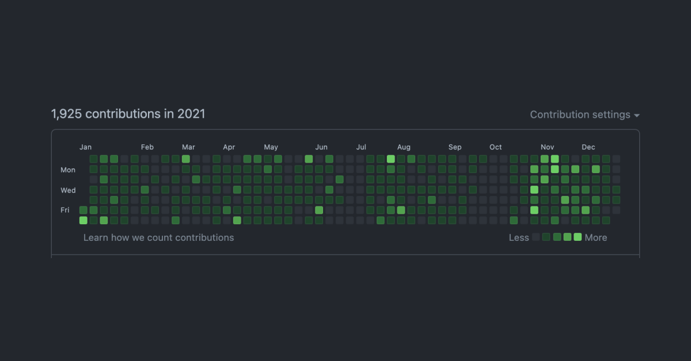
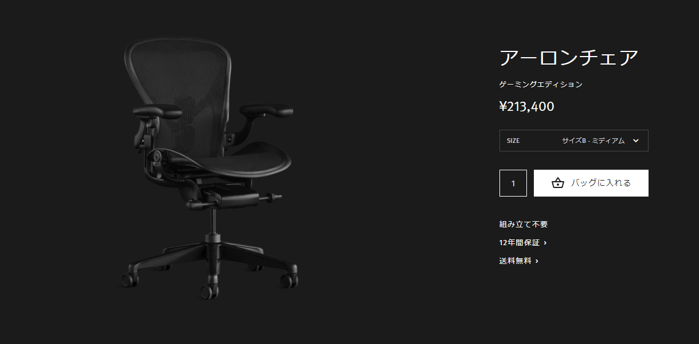
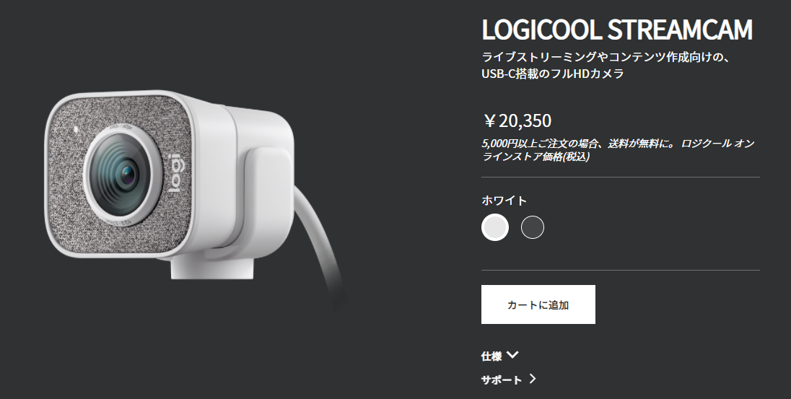

2021年が残り数日で終わるので反省も兼ねて振り返ります。

## ざっくりまとめ
就活が2月までに終わったので、研究や開発、趣味に多くの時間を割くことができました

### 1 - 3月
1月末に内定承諾をして就活が終わりました。２月は就活疲れの休養とSwiftの勉強をしつつ、運用しているメディアサイトをAWSに移行するなどしました。

3月からは内定者インターンをリモートで行っていました。エンジニアバイトはしたことがありましたが、ベンチャー企業での長期インターンは初めてだったこともあり、スピード感や初めて触る技術を**リモートで**キャッチアップするのは（私は）向いてないことに気がついた１ヶ月でした。

３月は研究の引き継ぎと急を要する開発のタスクが舞い込んできた１ヶ月だったこともあり、かなり忙しい1ヶ月でした。

### 4 - 6月
4月も引き続き内定者インターンを行っていました。

このときはまだコロナワクチンの接種も始まっておらず猛威を振るっていました。緊急事態宣言の合間を突いて東京でオフラインでのインターン業務を行いました。３月時点ではキャッチできなかった空気感やスピード感を肌で感じることができ、非常に充実していました。

5-6月は研究で引き継いだシステムに重大な欠陥が発覚し、またしても開発に追われる2ヶ月となりました。

### 7 - 9月
引き続き研究で利用するシステムの開発をしていました。

7月より、システムのフルリプレイスを開始し、DBの設計やアーキテクチャ選定などを通して普段考えないレイヤーの技術について学ぶことができました。

### 10 - 12月
フルリプレイスしたシステムを後輩に引き継ぐためヒアリングを行ったところ、技術力に懸念があったこともあり、ひとまず研究から少し距離をおいて休息することにしました。

まずは、このブログを作り変えることにしました。Gatsby.jsを利用したSSGのブログで、インフラ環境はAWSのS3+CloudFront+Lambda@Edgeを利用しました。AWSについて、より深く学習することができたように思います。

11月末に研究で利用するシステムのAPIサーバーが完成したので、フロントの開発をはじめました。年末にはほぼ完成したので、来年1月からは自由になれそうです。

## 今年の目標と達成状況
2020年1月に[今年の目標](/goal2021/)を決めました。

### 運用しているメディアサイトのインフラ環境をAWSに全移行
結果：⭕️

高校時代に作ったメディアサイトや、このブログを以前利用していた定額制のホスティングサービスからAWSに完全移行しました。この結果、パフォーマンスはほぼ同等で、月額の利用金額を40%ほど安くすることに成功しました。

### 毎月サービスリリース
結果：❌

全くできませんでした。アイデアもそんなに思いつきませんでした。

### 就活を終える
結果：⭕️

1月に終わりました。選択が間違っていたのか、正しかったのかは全く分からないですが、とにかく終わりました。自分の決断に後悔はしてません。

### 減量と筋トレ
結果：❌

4月までは順調に減量と筋肉量の増加ができていましたが、5月ごろから急増してしまいました。朝起きたら何かしら食べ物がある実家は最高です😂

2022年も継続してやっていきます。

## 買って良かった物・微妙だった物
### 買って良かった物 - アーロンチェア

Herman Miller - Aeron Remastered Gaming edition.

アーロンチェアでお馴染みのHerman Millerから発売されている「アーロンチェア ゲーミングエディション」を購入しました。

値段が20万を超える凄く良い椅子ですが、今後も座り仕事をすることが確定したので、インターンやサイト運営で頂いたお金で購入しました。利用し始めて数ヶ月経過しましたが、長時間座っていても全く腰が痛くなりません！12年保証がついているので、月額1,500円で利用できると思えばかなり安いですね…？

1点、本体の重さが23kgもあり、箱も超大型なので東京に引っ越すことが決まっているタイミングでの購入は失敗だったかもしれません。

### 微妙だった物 - StreamCam C980OW

Logicool - StreamCam C980OW

オンライン就活やリモートワークを見越して購入した同製品ですが、カメラの画質は良いものの、マイク性能が微妙でした。

音を**拾いすぎてしまう**特性があり、キーボードの音はもちろん、指をポキっと鳴らした音や、クリック音など30cm以上離れていてもかなり大きい音で拾ってしまいます。マイクは別で購入して利用するほうが綺麗に通話ができる気がします。

## 統計
- Twitter
    - Tweet：763（△289）
    - Impression：243,326（△216,497）
- Github
    - Contributions：1925（+148）

昨年度に比べて開発する時間・量が増加しました。Twitterは前と同じような時間を費やしていますが、アウトプットよりインプットのほうが多くなりつつあるみたいです。

## 来年の抱負
22年間、実家で温々と生きてきたわけですが、ついに出社する時間になりました。正直、結構ビビってますが、自分が選んだ場所と夢を目指して前向きに頑張っていきます。

2021年、たくさんの人にお世話になりました。来年もよろしくお願いします！！
