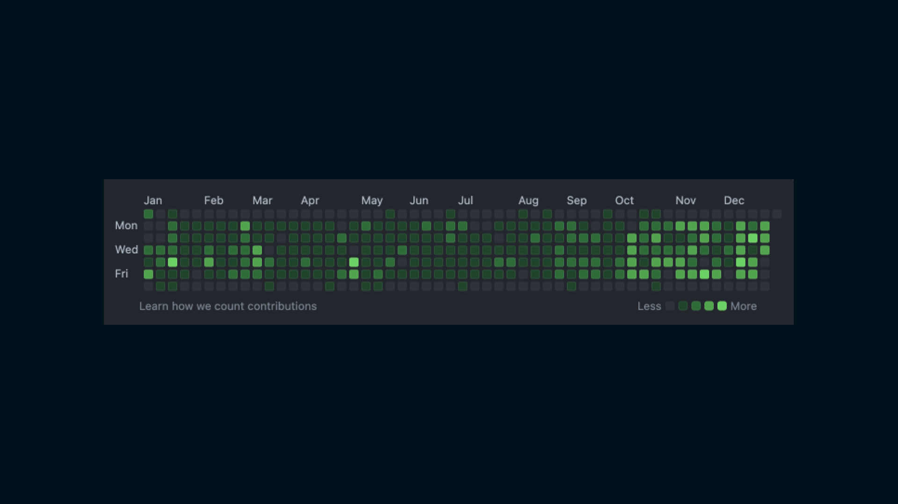

2023年が数時間で終わるので反省も兼ねて振り返ります

## ざっくりまとめ
- 今年も一年、会社を辞めるようなことがなかった
- iOSエンジニアとして着実に成長した
- 趣味サウナーになった
- 東京の美味しいお店や住んでる地域の憩いの場を発見した

## 詳細
仕事に関しては、今年はなんといっても、iOSエンジニアとして無事軌道に乗れたと思う一年でした。昨年は正直分からないことも多く、かなり焦っていましたが、今年はiOSエンジニアとしてどういった成長をしたいのか、もっと具体的になりました。

私生活に関しては、サウナにハマってしまいました。幼少期の頃から温泉にサウナが付属していたら入っていましたが、サウナを目的にするほどではありませんでした。今年の5月、名古屋〜北陸旅行をした際に毎日温泉とサウナに入る機会があり、気がつくと趣味サウナーになってました😂

好きなサウナは「サウナ東京」、おすすめしたいサウナは広島の尾道にある「尾道ふれあいの里」、次に行きたいサウナは「吉祥寺 MONSTER SAUNA」です。サウナだけで記事書けそうな雰囲気すらあるのでこの辺で、、、 💦

## 買って良かった物・微妙だった物
### 買って良かった物 - チョコザップ入会
チョコザップに入会したのが良い判断だったなと思いました。

半年で体脂肪率4%減、筋肉が増えたことで体型が細くなりました。複数店舗が家の近くにあるので、どのルートで家に帰っても必ず寄れる（寄らざるを得ない）ことも継続ポイントだと思います。

レッグプレスなどで利用する器具の負荷重量が物足りなくなりつつあるので、ぜひともプレートの追加をしてほしいところ。

### 微妙だった物 - Xiaomi Redmi buds Pro 4
ものすごく悪いわけではないが、「Xiaomi Redmi buds Pro 4」は購入して少し残念でした。

海外からの並行輸入品を購入したんですが、デバイスとの接続不良やノイズキャンセリングが急に効かなくなる、バッテリー的にはまだあるのに応答しなくなったり、外部のノイズに対して弱くプツプツと途切れるなど、全体的に不安定です。

ファームウェアのアップデートなどで解決するのであれば改善してほしいですね。

## 統計
- X
    - Post：379（△171）
    - Impression：40,529（△86,857）
- Github
    - Contributions：3,052（△217）

Xはほとんどポストしなくなりました。開発はコミット数こそ減っているものの、マージしたPR数だけでも300個近くあります。昨年に比べて開発速度がより一層向上した1年でした。

## 来年の抱負
仕事で言えばさらなるスキル向上、私生活でいえばもっとアクティブに活動していきたいですね🔥
