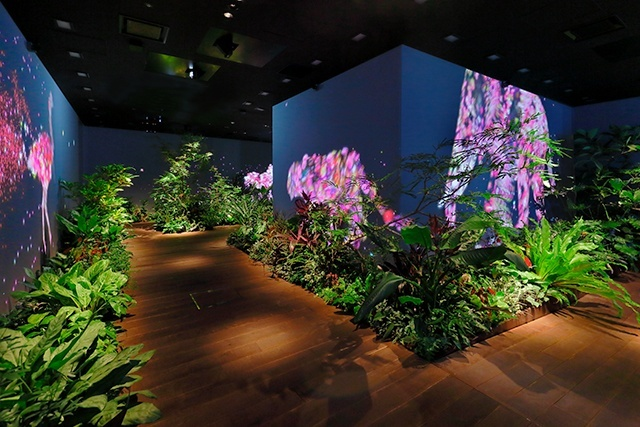

*写真はイメージです

DMM GUILD 2020 に参加しました

## DMM GUILD に参加した経緯
学生就活サービスのサポーターズにて実施される学生エンジニア向けのイベントである「エンジニア1on1面談」というものでDMMの人事やエンジニアの方とお話する機会があり、書類選考無しでのインターン選考に参加することになりました。

インターンの選考では面接官(人事・エンジニア)と1回のみ面接を行い、5月末にインターンの参加が確定しました。

## スケジュール
2020年09月07日〜2020年09月18日

- 1日目：  
	初日は企業紹介や参加者の自己紹介を行い交流会を実施した。とくに課題に手を付けるといったことはしていない。
- 2〜6日目：  
	実務上の課題にアサインして解決する。実務上の課題とは、実際にリリース(or 開発)されているサービスのリファクタリングや機能追加、スタイル修正などGithubのIssueとして挙げられるような内容の粒度を解決していく。難易度は課題ごとに異なるが、社員が取り組んでも最大で4日程度で解決できる粒度で発行されている。
- 7日目：  
	事前に決められているグループにてチームビルディング研修に参加した。参加者と意見を交わせる貴重な時間で、一日で色々な人と話せることもあり、すごく楽しかったです！
- 8〜10日目：  
	2〜6日目同様にIssueへの取り組み。学生によっては最高難易度の課題を1日で解決したり、暇を持て余した学生がヘルプを募集するなどしていました。

## 一日の動き
初日やチームビルディングは変則的ですが、課題を取り組む日の一日の動き

| 時間         | 内容                   |
| ------------ | ---------------------- |
| 8:30         | 起床                   |
| 10:00        | 出勤                   |
| 10:00〜10:30 | 朝会                   |
| 10:30〜13:00 | 午前の課題取り組み     |
| 13:00〜14:00 | 昼食                   |
| 14:00〜19:00 | 午後の課題の取り組み   |
| 19:00        | 退勤                   |
| 19:00〜19:30 | グループメンバーと雑談 |

## 課題の取り組み
複数の課題が発行されているが、比較的ライトなものから、そこそこヘビーなものまで色々と取り組みました。DevOpsの改善からUI/UX改修、パフォーマンスチューニングなどの課題があり、自由にアサインが可能でした。

フロントエンドの課題を中心に取り組みましたが、大半はRailsやGoなどを利用したサーバサイドの課題でした。フロントエンドの課題はあるものの、ReactやGraphQL関する内容が多いように感じました。

最終的なポイント数は平均くらいでした。

## フィードバック
- 技術力(プログラミング、アーキテクチャ)
- 交渉力(仕様実装方針、ポイント)
- 知識力

一番不足していたのは「技術力」でした。圧倒的にプログラミング能力、アーキテクチャ実装の経験がないことを実感しました。

個人開発でサーバサイドからフロントエンドまで触ってプロダクトを出してきましたが、得意としていた言語、フレームワークのチケットを当初の仕様通りに完遂出来なかったことは悔しいです。

また、AWSや各種ツールの知識についても不足している部分が多くあったと考えています。「周りの学生が優秀だから気負いすることはない」というアドバイスも頂きましたが、同じ土俵に立っている学生として悔しいです。

他の学生に引けを取らないスキルを身につける必要がありそうです。

## FAQ
- 服装について
	- 前提は私服でした。人によって襟付きシャツを着ている人もいました。
	- 私は多人数で話す場面や面談時は襟付きのシャツを着ていました。
- 休みとか取れる？
	- 個別相談
	- 研究や学会発表で期間中1日程度抜ける人はいました。
- 貸与PCのスペックは
	- Macbook Pro(windows可) US配列、13inc、16GBメモリ、2019年モデル
- 給与関係
	- 時給制（1,500円/h）+ (残業) + ボーナス
