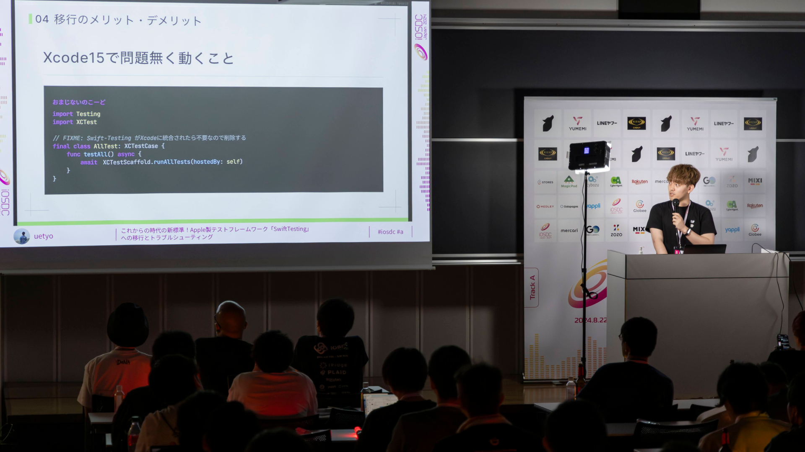

`youtube:https://www.youtube.com/embed/54EsJ10WP4M?si=SEcIcnajr5FDVI0D`

2024年8月22日(木)〜24日(土)に東京、早稲田大学理工学部西早稲田キャンパスにて、国内最大級のiOSを主軸とするカンファレンスである[iOSDC Japan 2024](https://iosdc.jp/2024/)が開催され、ルーキーズLT枠として登壇しました。

AppleはWWDC 2024にて、[SwfitTesting](https://developer.apple.com/jp/xcode/swift-testing/)という新しいテストフレームワークを公開しました。クラシルリワードでは正式発表前にいち早く導入を決定していました。iOSDCでは新しいフレームワークへの移行作業や移行時に直面した問題のトラブルシューティングについて発表しました。

記事はこちら：[iOSDC Japan 2024 に登壇しました](https://zenn.dev/dely_jp/articles/0a5ab5913a76e3)
