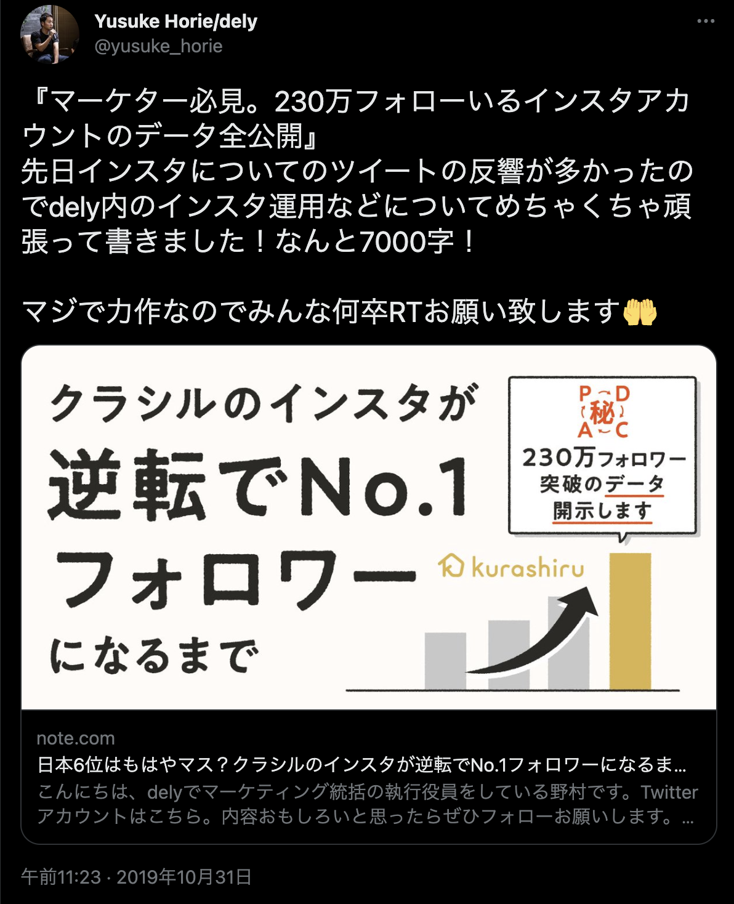

2022年4月1日に国内最大のレシピプラットフォーム“クラシル”を運営する dely株式会社 へ入社しました。完全未経験でしたがiOSアプリエンジニアとして勤務しています。

## delyとの出会い
delyとの出会いは、フォローしていた起業家の方がリツイートした記事に強く興味を惹かれたことがきっかけです。

実際に回ってきたツイート：https://twitter.com/yusuke_horie/status/1189729555545612290

当時は、実家暮らしだったこともあり、献立を考えることは滅多にありませんでした。そのため、料理が掲載されているサービスといえば「クックパッド」というイメージが強かったのですが、この記事を見てクラシルに対する世間の熱量と次の時代の始まりを感じました。

2019年11月にこの記事を読んで約1年、就活イベントでたまたま面談をする機会がありいくつかの選考の後、21年の1月に内定を承諾しました。

## delyへの入社
delyに入社したら毎日美味しそうな料理動画を見ながら仕事ができるかも、という安易な考えと、20代のうちに身を置きたい環境にマッチしていたため入社を決意しました。

### 1.入社理由 - 変化の速度と成長角度
19年の秋くらいは料理動画でインスタグラムのフォロワーを爆増させていたかと思えば、面談時にはチラシなどのリアル店舗とデジタルをつなげるリテールプラットフォームの構築、オンラインショッピングのコマース領域にも進出していました。

環境が変わる速度の速さや、既存事業を常に改革しながら突き進む大胆さ、事業成長の角度、順応するチーム・人と一緒に仕事がしたい！と思いました。

### 2.入社理由 - 情報の透明性とデータアクセス権
DMM社のインターンを受けたこともあり、情報の透明性には強いこだわりがありました。

面談時に似たような質問をさせて頂いたところ、オープンなSlackチャンネル数が多すぎたり、一日の情報量が多すぎてとても全部は追いきれないという環境があるとのことでした。

また、エンジニアだとしても経営的な視点や接点は持っておきたいと考えています。こちらも、サービスのログや売上など基本的にどの役職でもアクセスできる環境があるとのことでした。

将来的には、PMになることで経営方針に直接影響を与える働き方を勉強したいと考えています。役職にとらわれること無く勉強できる環境が初めから整っていることにとても感動しました！

### 3.入社理由 - ファーストキャリアへの思い
「20代のうちはチャンスがある限り全部やる」「QOL・ワークライフバランスは二の次」という考え方のもと、ファーストキャリアでは多少激務でカオスが予想される会社を選択しようと考えていました。

エンジニアと経営のハイブリッドマインドな人間だと考えているので20代のうちに色々と種を蒔いてみて自分の得意な領域を探したいです。ひとまず、初めはエンジニアとして生活することが直近のキャリア戦略です。

## モバイルアプリエンジニアとしての一歩
学生時代はサーバ〜Webフロントを主にやっていましたが大したスキルも持っていなかったので、面談等でどのポジションに入りたいか相談を受けた際に「なんでもやります！勉強します」と言ったところiOSエンジニアに決まりました。

その他にも色々と、社長から感じるオーラ、感覚的なものを色々と感じた就職活動でした。

新卒エンジニアとして「やっていき」の精神を大切に挑戦します🔥
