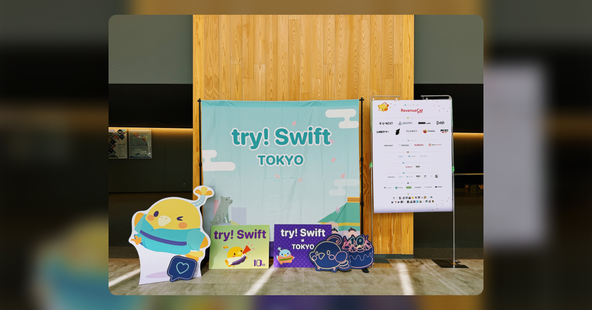
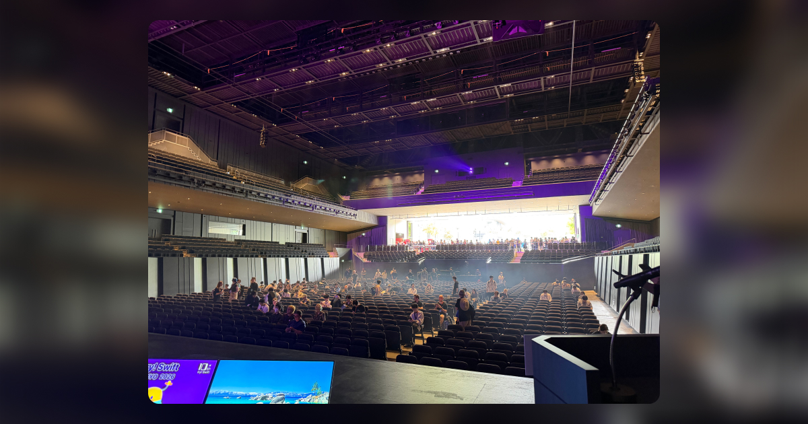

try! Swift Tokyo 2026 にオーガナイザー（運営）として参加しました！

参加自体は今年で3回目、これまでの2回は当日スタッフとしてお手伝いしていましたが、今回は準備段階から関わりました。

## 担当した領域
オーガナイザーとして初年となる今回は、スピーカー周り全般を担当しました。

- スピーカーとのやり取り（来日前の各種調整）
- ホテルと航空券を旅程パートナーと手配・調整
- 当日のアテンド

try! Swfit は国内外のスピーカー・参加者が集まる国際カンファレンスです。モバイル領域ではトップクラスの規模を誇っています。

カンファレンスが成功するかどうかを左右する重要なポイントである海外スピーカーとのやり取りを一元的に引き受けて進める、またとない経験を得ました。

英語はもちろん、タイムゾーンやラグを気にしながらのメールやSlackは、神経をすり減らしながら進めました 💦

## 準備期間で苦労したこと
一番大変だったのはやはり航空券とホテルまわりの調整です。

スピーカーごとに到着・出発の希望日が違い、トランジットや空港の希望、予定の変更、旅程パートナーの連絡遅延など数多くの問題が頻発しました。また、ホテルのチェックインや部屋タイプの確認、スピーカー種別ごとの確認など整理観点も多く、単純な作業量が非常に多かったです。

「準備準備準備+リカバー」という言葉が頭をよぎる場面が何度もありました。

## カンファレンス当日動き
当日スタッフのメンバーとどのようにスピーカーをアテンドするか共有し、スピーカーが会場についたらスムーズに控室に案内したり、リハーサルや登壇前後のフォローを行いました。

事前にメッセンジャーでしかやり取りしていなかったスピーカーと初めて対面した瞬間は、なんとも言えない達成感がありました。「あなたがuetyoさんですね！」というやり取りを何度もしました。

セッションを聞く余裕は多くはありませんでしたが、自分が担当したスピーカーが満員の会場で発表しているのを見ると、準備の苦労が一気に報われた気持ちになりました。

## 当日スタッフとコアスタッフの違い
当日スタッフだった頃は「カンファレンスを作っている人たちすごいな〜」と外から眺めている感覚でしたが、内側に入ってみるとそれぞれの担当領域が想像以上に多く、しかも一つひとつの判断が当日のスピーカー体験や参加者体験に直結することを実感しました。

裏側では本当に多くの議論と調整が走っていて、try! Swift Tokyoのクオリティや規模、世界中の開発者が参加する故のD&Iを実現するため、長年積み上げられてきたノウハウと、それを引き継いで動かしている方々のおかげなんだなと改めて感じています。
